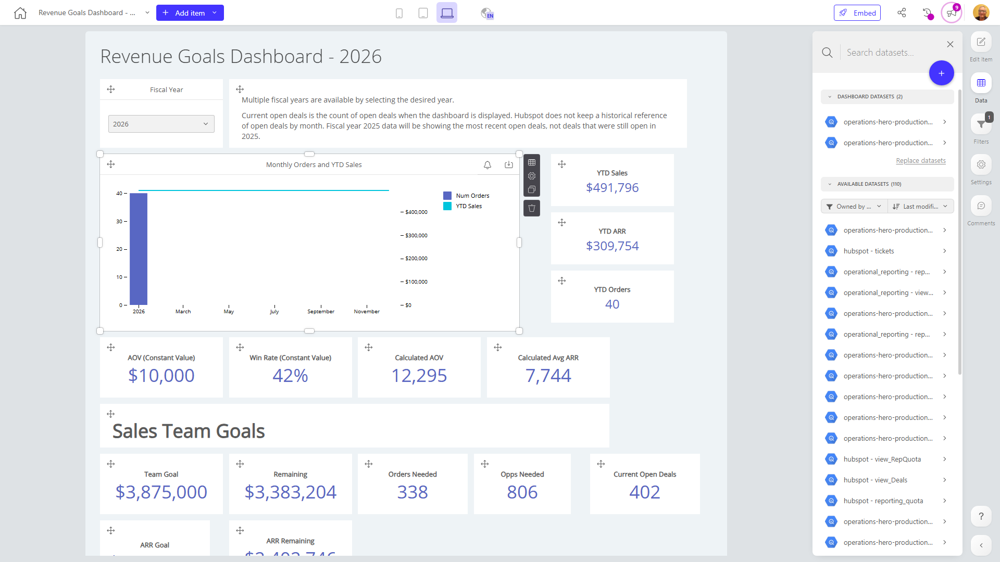

# Revenue Goals Dashboard - 2026

**Collections:** None

## Screenshot

## Description

The "Revenue Goals Dashboard - 2026" is a comprehensive reporting tool designed for sales and finance teams to track and analyze their company's financial performance and progress towards revenue goals for the upcoming fiscal year.

This dashboard pulls data from 2 connected datasets to provide a detailed, 360-degree view of key revenue metrics and trends. It features a diverse set of 120 visual components, including:

- Evolution numbers that showcase year-over-year comparisons for critical metrics like YTD Sales, YTD ARR, and Calculated Avg ARR
- Combination charts that plot monthly orders alongside YTD sales to identify seasonal patterns
- Pivot tables that break down sales performance by various dimensions
- Dropdown filters that allow users to analyze data by fiscal year

The dashboard answers essential questions such as:

- How are we performing against our annual revenue goals?
- Which product lines or customer segments are driving the most growth?
- How do our current open deals compare to previous years?
- What is the month-over-month and year-over-year trend for key metrics like orders and ARR?

By providing a centralized view of critical revenue data, this dashboard empowers sales, finance, and executive teams to make informed, data-driven decisions to achieve their 2026 revenue targets. The variety of visualization types and analytical tools cater to the needs of different stakeholders, from high-level executives to sales operations analysts.

## AI-Generated Summary

The "Revenue Goals Dashboard - 2026" is a comprehensive reporting tool designed to help sales and finance teams track and analyze their company's financial performance and progress towards revenue goals for the upcoming fiscal year. This dashboard pulls data from multiple connected datasets to provide a detailed, 360-degree view of key revenue metrics and trends. It features a diverse set of visual components, including evolution numbers, combination charts, pivot tables, and dropdown filters, to help users answer critical questions about sales performance, product growth, open deals, and year-over-year trends. By centralizing this critical revenue data, the dashboard empowers stakeholders across the organization to make informed, data-driven decisions to achieve their 2026 revenue targets.

### Tags

`revenue` `sales` `finance` `performance management` `data visualization`

---

*Generated on 2026-01-29 12:48:21 by Luzmo API Tools*