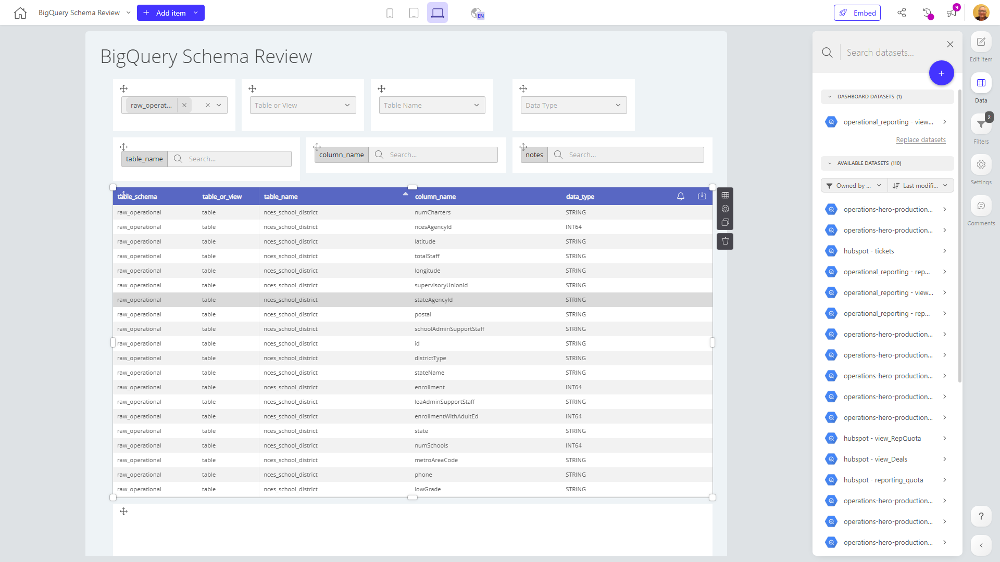

# BigQuery Schema Review

**Collections:** None

## Screenshot

## Description

This BigQuery Schema Review dashboard provides a comprehensive overview of the schemas and data structures within a BigQuery data warehouse. It is likely designed for data engineers, data analysts, and database administrators who need to understand and manage the complex data models and schema definitions powering their organization's analytics and reporting.

The dashboard consists of 27 components, the majority of which are dropdown filters and search filters. These allow users to quickly navigate and explore the various tables, fields, and schema details stored in BigQuery. The three regular table components likely display the actual schema information, such as table names, field definitions, data types, and other metadata.

By providing an interactive, visual interface to review the BigQuery schema, this dashboard helps users answer questions like:
- What tables and data models exist in our BigQuery environment?
- What are the specific fields, data types, and schema definitions for each table?
- How can I quickly search and filter the schema details to find relevant information?
- What is the overall structure and organization of our data warehouse?

This dashboard empowers data teams to better understand, maintain, and optimize the underlying data architecture supporting critical business analytics and reporting. It serves as a valuable tool for data governance, schema management, and supporting data-driven decision making.

## AI-Generated Summary

This BigQuery Schema Review dashboard provides a comprehensive overview of the schemas and data structures within a BigQuery data warehouse. It is designed for data engineers, data analysts, and database administrators who need to understand and manage the complex data models and schema definitions powering their organization's analytics and reporting. The dashboard's interactive filters and tables allow users to quickly navigate, explore, and search the various tables, fields, and schema details stored in BigQuery. This helps data teams better understand, maintain, and optimize the underlying data architecture supporting critical business analytics and reporting. The dashboard serves as a valuable tool for data governance, schema management, and supporting data-driven decision making.

### Tags

`data governance` `schema management` `data architecture` `data modeling` `analytics`

---

*Generated on 2026-01-29 12:46:00 by Luzmo API Tools*