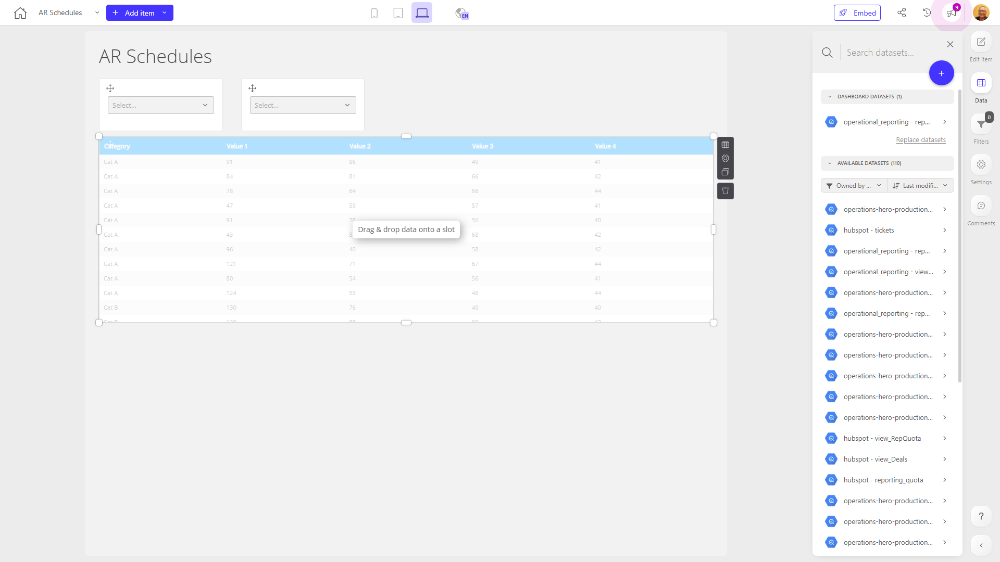

# AR Schedules

**Collections:** None

## Screenshot

## Description

The "AR Schedules" dashboard provides a comprehensive view of accounts receivable (AR) data for an organization. This dashboard is likely used by finance and accounting teams to monitor and manage outstanding customer invoices and payments.

The dashboard consists of 9 components, primarily made up of 6 dropdown filters and 3 data tables. The dropdown filters allow users to search and select specific criteria to filter the underlying AR data, such as customers, invoice dates, or payment statuses. The 3 data tables then display the filtered AR information in a structured format.

Some of the key insights and questions this dashboard likely answers include:

1. Customer AR status: The data tables provide detailed information about outstanding customer invoices, including invoice amounts, due dates, and payment status. This allows finance teams to easily identify late or delinquent payments and follow up with customers accordingly.

2. AR aging analysis: By applying different filters, users can analyze the AR aging, or the breakdown of invoices by how long they have been outstanding. This helps identify potential cash flow issues and areas for improved collection efforts.

3. Customer payment trends: The dashboard enables users to track customer payment behavior over time, such as which customers tend to pay on time versus those with persistent late payments. This information can inform credit policies and customer relationship management strategies.

Overall, the "AR Schedules" dashboard serves as a centralized hub for finance and accounting teams to monitor, analyze, and manage their organization's accounts receivable. The combination of filtering options and data tables provides a powerful tool for understanding the company's AR position and taking appropriate actions to optimize cash flow and customer relationships.

## AI-Generated Summary

The "AR Schedules" dashboard provides a comprehensive view of accounts receivable (AR) data, enabling finance and accounting teams to monitor and manage outstanding customer invoices and payments. The dashboard offers a range of filtering options to analyze AR aging, customer payment trends, and the overall AR status of the organization. Key insights include identifying late or delinquent payments, optimizing cash flow, and informing customer relationship management strategies. This centralized dashboard serves as a powerful tool for finance professionals to understand the company's AR position and take appropriate actions to improve cash flow and customer relationships.

### Tags

`accounts receivable` `cash flow management` `customer payment analysis` `financial reporting` `credit management`

---

*Generated on 2026-01-29 12:46:41 by Luzmo API Tools*