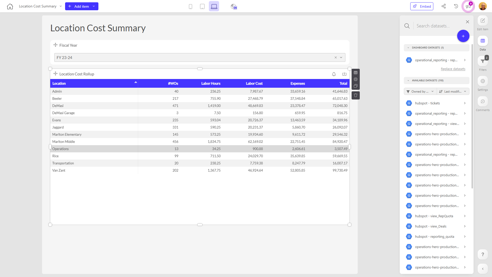

# Location Cost Summary

**Collections:** Production Dashboards

## Screenshot

## Description

The "Location Cost Summary" dashboard provides a high-level overview of location-based costs for an organization. This dashboard would be useful for executives, finance teams, and operational managers who need to understand and track location-related expenses.

The dashboard has three key components:

1. Fiscal Year Selector: This dropdown filter allows users to view location cost data for a specific fiscal year.

2. Location Cost Rollup: This table displays a summary of total costs broken down by location. Users can see the overall cost for each location, which could be helpful for identifying high-cost or low-cost areas.

3. Location Cost Rollup: This second instance of the location cost table provides another view of the same data, potentially allowing users to sort, filter, or group the information in different ways.

By having multiple instances of the location cost table, the dashboard gives users flexibility to analyze the data from different perspectives. The fiscal year selector also enables them to track changes in location costs over time.

Overall, this dashboard consolidates critical location-based cost information into a centralized view, empowering stakeholders to make more informed decisions about managing and optimizing expenses across the organization's locations.

## AI-Generated Summary

The "Location Cost Summary" dashboard provides a comprehensive overview of location-based expenses for an organization. It empowers executives, finance teams, and operational managers to understand, track, and optimize costs across different locations. The dashboard offers multiple views of location-related expenditures, allowing users to analyze the data from various perspectives and identify cost-saving opportunities. With a fiscal year selector, stakeholders can monitor changes in location costs over time, informing strategic decisions and resource allocation.

### Tags

`location cost analysis` `expense management` `financial reporting` `operational efficiency` `business intelligence`

---

*Generated on 2026-01-29 12:43:15 by Luzmo API Tools*