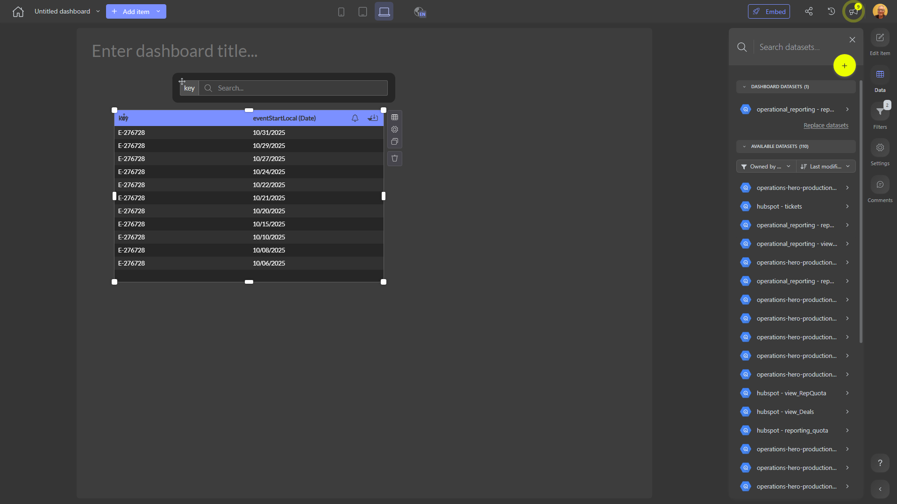

# 

**Collections:** None

## Screenshot

## Description

This dashboard is designed to provide users with a comprehensive view of data from a single connected dataset. The dashboard consists of six components, including three search-filter components and three regular-table components.

The search-filter components allow users to easily filter and refine the data displayed in the regular-table components. This enables users to quickly identify and focus on the most relevant information for their needs.

The regular-table components present the data in a structured, tabular format, making it easy for users to review and analyze the information. These tables likely display a variety of relevant data points and metrics that are important for understanding the business or operational area this dashboard is focused on.

Overall, this dashboard is likely used by decision-makers, analysts, or operational teams who need to regularly access and explore data-driven insights related to the connected dataset. The combination of search-filter and regular-table components allows users to quickly find, filter, and analyze the information they need to make informed decisions, identify trends, and optimize processes.

Without specific details on the connected dataset or the parameters available, it's difficult to determine the exact purpose or use cases for this dashboard. However, the general structure and component types suggest it is a versatile tool that can be used to support a wide range of data-driven activities and decision-making processes within the organization.

## AI-Generated Summary

This comprehensive dashboard provides users with a powerful tool to explore and analyze data from a single connected dataset. The combination of search-filter and regular-table components enables decision-makers, analysts, and operational teams to quickly find, filter, and review relevant information to support a wide range of data-driven activities and decision-making processes.

The search-filter components allow users to easily refine the data displayed in the regular-table components, empowering them to identify and focus on the most relevant insights. The regular-table components present the data in a structured, tabular format, making it easy for users to review and analyze the information.

This dashboard is likely used by those who need to regularly access and explore data-driven insights related to the connected dataset, such as understanding business performance, identifying trends, and optimizing processes. The versatile design of the dashboard ensures it can support a variety of use cases and meet the needs of different stakeholders within the organization.

### Tags

`data analytics` `business intelligence` `performance management` `decision support` `operational insights`

---

*Generated on 2026-01-29 11:53:06 by Luzmo API Tools*