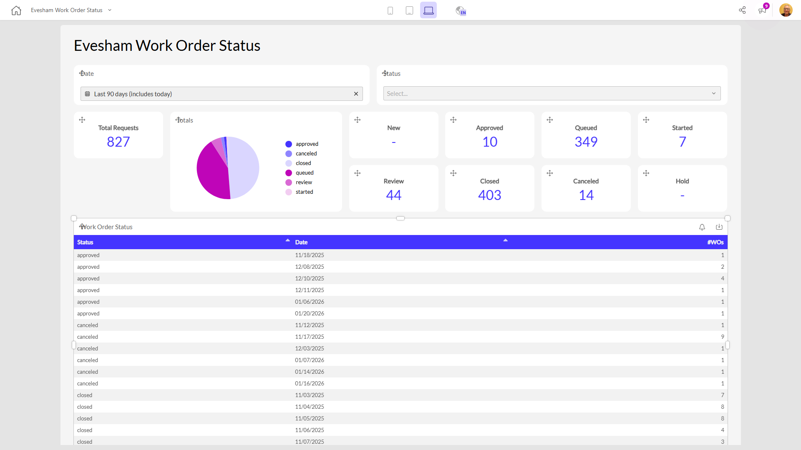

# Evesham Work Order Status

**Collections:** Production Dashboards

## Screenshot

## AI-Generated Summary

This dashboard provides an overview of the work order status for the Evesham organization. It displays the total number of requests, as well as the breakdown by different statuses such as new, approved, queued, started, review, closed, canceled, and on hold. Users can filter the data by date and status to quickly understand the current state of work orders and identify any bottlenecks or areas that need attention. This dashboard would be valuable for managers, supervisors, and operations teams responsible for monitoring and managing the work order process.

### Tags

`work orders` `operations` `status tracking` `business intelligence` `performance monitoring`

---

*Generated on 2026-01-29 12:48:49 by Luzmo API Tools*