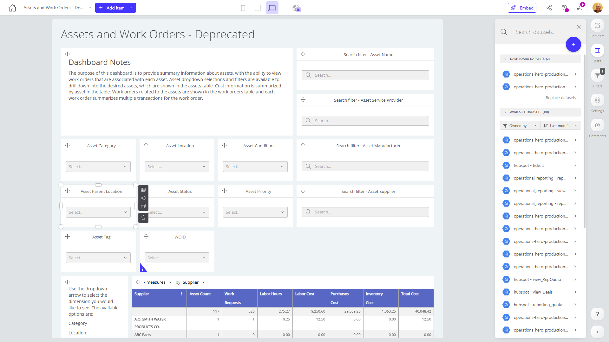

# Assets and Work Orders - Deprecated

**Collections:** Production Dashboards

## Screenshot

## Description

This deprecated "Assets and Work Orders" dashboard provides a comprehensive view of an organization's asset management and maintenance operations. It is designed to help asset managers, maintenance teams, and operations personnel monitor and analyze the company's physical assets and associated work orders.

The dashboard features a variety of interactive components, including:
- Dropdown filters to allow users to quickly narrow down the data by asset category, location, condition, status, priority, and more
- Search filters to search for specific assets by name, manufacturer, supplier, and other attributes
- Text components to provide context and instructions
- Two tables - one displaying the assets themselves, and another showing the associated work orders

The asset table allows users to click on a specific asset row to view more details about that asset. The work orders table provides an overview of the maintenance activities being performed on the company's assets.

Additionally, the dashboard includes a pivot table component, which likely offers the ability to analyze asset and work order data in a more flexible, summarized format.

Overall, this dashboard seems designed to give asset managers and maintenance teams a centralized view of the company's physical assets and the work being done to maintain and repair them. It enables users to filter, search, and analyze asset and work order data to identify trends, monitor performance, and make data-driven decisions about asset management and maintenance strategies.

## AI-Generated Summary

This deprecated "Assets and Work Orders" dashboard provides a comprehensive view of an organization's asset management and maintenance operations. It helps asset managers, maintenance teams, and operations personnel monitor and analyze the company's physical assets and associated work orders. The dashboard features interactive filters to narrow down data by asset category, location, condition, status, priority, and more. It displays two tables - one for assets and another for related work orders. Additionally, a pivot table component allows for flexible data analysis. This dashboard enables users to identify trends, monitor performance, and make data-driven decisions about asset management and maintenance strategies.

### Tags

`asset management` `work orders` `maintenance` `operations` `data analysis`

---

*Generated on 2026-01-29 12:46:57 by Luzmo API Tools*