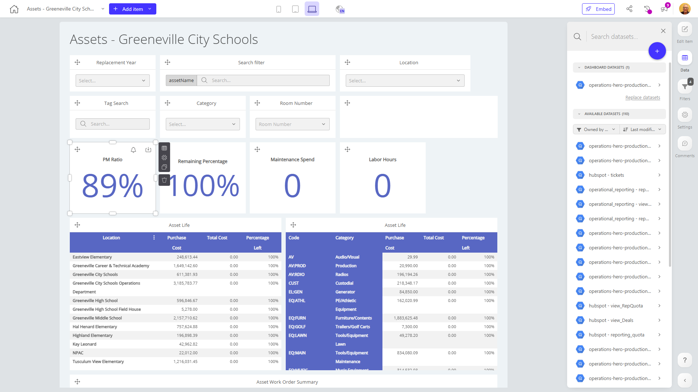

# Assets - Greeneville City Schools

**Collections:** Production Dashboards

## Screenshot

## Description

The "Assets - Greeneville City Schools" dashboard provides a comprehensive view of the assets and maintenance activities across the Greeneville City Schools district. This dashboard is likely used by facilities managers, maintenance teams, and school administration to monitor and manage the district's physical assets.

The dashboard contains 45 components that cover various aspects of asset management, including:

- Filters: Users can filter the data by attributes like Replacement Year, Location, Category, and Room Number to focus on specific asset groups.
- Search: Users can search for assets by keyword or tag to quickly find relevant information.
- Asset Details: The dashboard displays detailed information about each asset, including its Asset Life, Maintenance Spend, Labor Hours, and PM (Preventive Maintenance) Ratio.
- Asset Summaries: High-level summaries of the asset portfolio are provided through pivot tables and regular tables, giving users a quick overview of the asset work order history and asset listing.
- Trend Metrics: Key performance metrics like Maintenance Spend and Labor Hours are tracked over time using evolution number components, allowing users to identify trends and monitor the overall asset health.

By consolidating all this asset-related information into a single dashboard, facilities managers and maintenance teams can easily track the condition and performance of the district's assets, identify areas that require attention, and make informed decisions about maintenance, replacement, and resource allocation. This dashboard supports efficient asset management and helps ensure the schools have the necessary resources to provide a high-quality learning environment for students.

## AI-Generated Summary

The "Assets - Greeneville City Schools" dashboard provides a comprehensive view of the physical assets and maintenance activities across the Greeneville City Schools district. This dashboard is designed to help facilities managers, maintenance teams, and school administrators monitor the condition, performance, and lifecycle of the district's assets. Users can filter the data by various attributes like location, category, and room to quickly identify areas that require attention. The dashboard displays detailed asset information, including maintenance spend, labor hours, and preventive maintenance ratios, allowing users to make data-driven decisions about asset maintenance, replacement, and resource allocation. By consolidating this asset-related information in a centralized dashboard, the district can ensure its facilities and equipment are properly maintained to support a high-quality learning environment for students.

### Tags

`asset management` `facilities maintenance` `school administration` `performance monitoring` `data-driven decision making`

---

*Generated on 2026-01-29 12:46:52 by Luzmo API Tools*