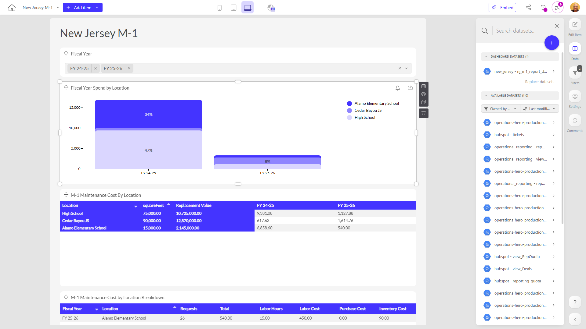

# New Jersey M-1

**Collections:** Production Dashboards

## Screenshot

## Description

The "New Jersey M-1" dashboard is designed to provide insights and analysis on the maintenance costs and spending for the M-1 project in New Jersey. This dashboard would be useful for public sector officials, transportation department managers, and project stakeholders who need to understand and track the financial performance of the M-1 maintenance efforts.

The dashboard includes a total of 12 components, consisting of 3 dropdown filters, 3 column charts, 3 pivot tables, and 3 regular data tables. The key components are:

1. Fiscal Year Filter: Allows users to select the specific fiscal year they want to analyze.
2. Fiscal Year Spend by Location: Column charts that show the overall M-1 maintenance spending broken down by geographic location.
3. M-1 Maintenance Cost By Location: Pivot tables that provide a detailed breakdown of the maintenance costs for the M-1 project by location.
4. M-1 Maintenance Cost by Location Breakdown: Regular data tables that offer a more granular view of the maintenance costs, also organized by location.

Together, these components enable users to understand the historical trends and current status of the M-1 maintenance program, including how costs and spending are distributed across different geographic areas. This information can help identify cost drivers, optimize resource allocation, and support decision-making around the M-1 project.

The dashboard is connected to a single dataset and has one configurable parameter (the fiscal year selection). This allows users to focus their analysis on the specific time periods and geographic areas of interest.

Overall, the "New Jersey M-1" dashboard provides a comprehensive view of the M-1 maintenance program, empowering stakeholders to monitor financial performance, identify areas for improvement, and make data-driven decisions to ensure the efficient and effective management of this critical infrastructure project.

## AI-Generated Summary

The "New Jersey M-1" dashboard provides a comprehensive view of the maintenance costs and spending for the M-1 project in New Jersey. This dashboard is designed to help public sector officials, transportation department managers, and project stakeholders understand the financial performance of the M-1 maintenance program. The dashboard offers insights into the historical trends and current status of maintenance costs, with the ability to analyze spending by geographic location. This information can support decision-making around resource allocation, cost optimization, and the overall management of this critical infrastructure project.

### Tags

`maintenance` `infrastructure` `transportation` `finance` `project management`

---

*Generated on 2026-01-29 12:46:54 by Luzmo API Tools*