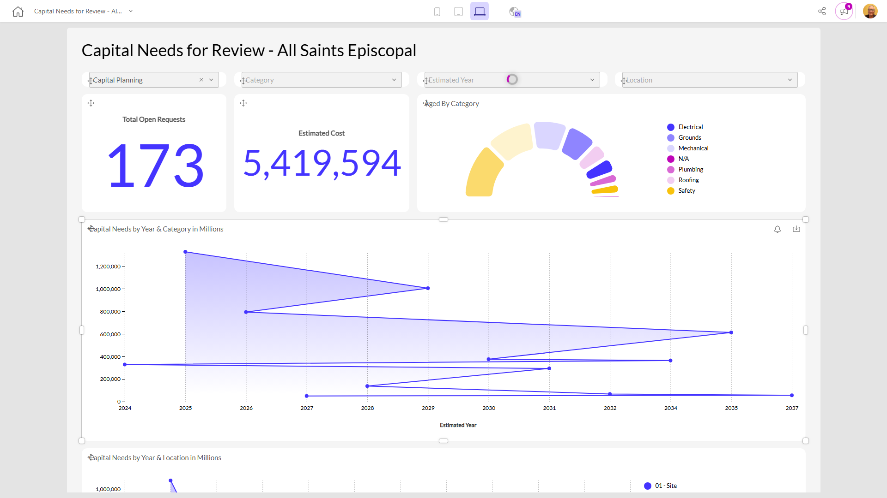

# Capital Needs for Review - All Saints Episcopal

**Collections:** Production Dashboards

## Screenshot

## AI-Generated Summary

This dashboard provides a comprehensive view of the capital needs for All Saints Episcopal. It allows users to explore and analyze open requests, estimated costs, and the distribution of capital needs by year, category, and location. The dashboard includes various visualizations, such as evolution numbers, line charts, and donut charts, as well as interactive filters and a pivot table to enable in-depth analysis. This dashboard would be valuable for facilities management, finance, and decision-makers who need to assess and plan for the organization's capital requirements.

### Tags

`capital planning` `facilities management` `cost estimation` `budget analysis` `asset management`

---

*Generated on 2026-01-29 12:48:43 by Luzmo API Tools*