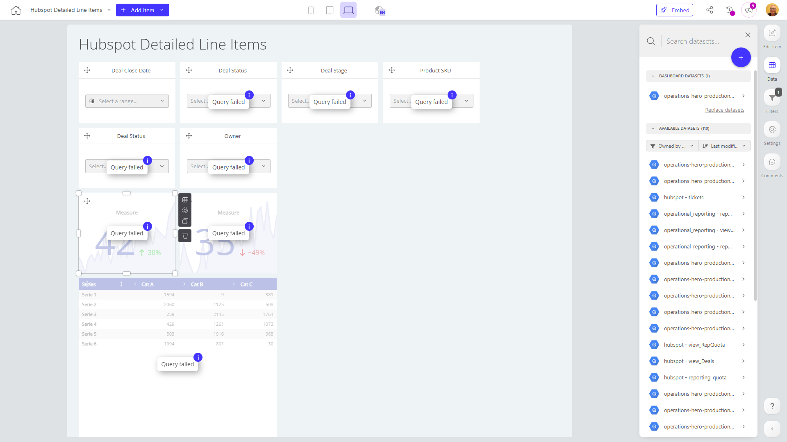

# Hubspot Detailed Line Items

**Collections:** Internal

## Screenshot

## Description

The Hubspot Detailed Line Items dashboard is designed to provide sales teams and managers with a comprehensive view of their deal pipeline and performance. This dashboard offers a wide range of capabilities, including:

1. Filtering and segmentation: The dashboard includes multiple dropdown filters that allow users to slice and dice data by deal status, stage, product SKU, and owner. This enables users to quickly identify trends and patterns within specific segments of their sales funnel.

2. Deal tracking and monitoring: The dashboard features several evolution-number components that display key metrics such as the number of open deals and deals with a specific status or stage. These visualizations allow users to track the progress and health of their sales pipeline over time.

3. Detailed reporting: The dashboard includes pivot tables and regular tables that provide a granular view of individual deal-level data. Users can access detailed information about deals, including close dates, status, and other relevant attributes.

4. Holistic performance analysis: By combining the filtering capabilities, trend visualizations, and detailed reporting, this dashboard empowers sales leaders and managers to analyze their team's overall sales performance, identify areas for improvement, and make data-driven decisions to drive business growth.

This dashboard is likely to be used by sales executives, managers, and analysts who need to closely monitor their sales pipeline, understand deal-level details, and make informed decisions to optimize their sales strategies and processes.

## AI-Generated Summary

The Hubspot Detailed Line Items dashboard provides sales teams and managers with a comprehensive view of their deal pipeline and performance. It enables users to filter and segment data by key criteria such as deal status, stage, product, and owner, allowing them to quickly identify trends and patterns within their sales funnel. The dashboard features visualizations that track the progress and health of the sales pipeline over time, as well as detailed reporting on individual deal-level data. This empowers sales leaders and managers to analyze their team's overall sales performance, identify areas for improvement, and make data-driven decisions to optimize their sales strategies and processes.

### Tags

`sales performance` `deal pipeline` `sales reporting` `data-driven decision making` `business intelligence`

---

*Generated on 2026-01-29 12:47:09 by Luzmo API Tools*