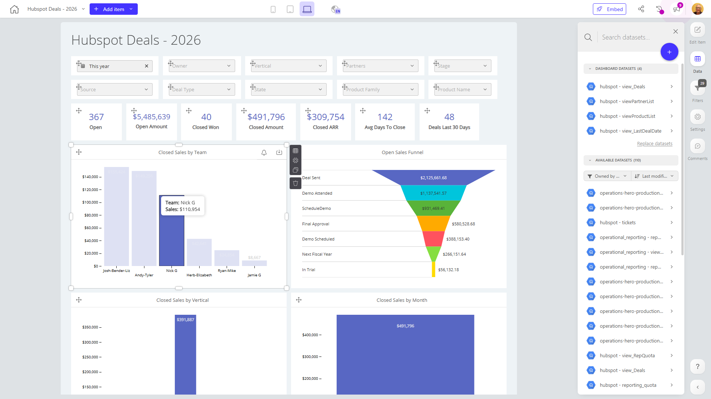

# Hubspot Deals - 2026

**Collections:** Internal

## Screenshot

## Description

The "Hubspot Deals - 2026" dashboard is a comprehensive reporting tool for analyzing and tracking sales performance and pipeline for a business. It appears to be designed for sales managers, executives, and revenue operations teams who need visibility into key deal metrics and trends.

This dashboard contains a wide variety of visualizations and interactive components to provide deep insights, including:

- Deal performance metrics like open deals, closed deals, closed amount, and closed ARR
- Sales funnels and forecasting with charts showing closed sales by team and vertical
- Detailed breakdowns and trends using evolution numbers, column charts, and tables
- Filtering and drill-down capabilities via dropdown menus, date filters, and slicers

The dashboard draws data from 4 connected datasets, allowing users to analyze deals, sales, and revenue from multiple angles. The range of filter options and visualization types suggest this dashboard is meant to be a one-stop-shop for understanding the company's sales pipeline, performance, and forecasting.

Overall, this dashboard seems to be a powerful tool for sales leaders to monitor KPIs, identify opportunities and risks, and make data-driven decisions to drive revenue growth. The depth of analysis possible across teams, verticals, and the full sales cycle indicates this is a strategic reporting tool for the organization.

## AI-Generated Summary

The "Hubspot Deals - 2026" dashboard is a comprehensive reporting tool designed for sales leaders, executives, and revenue operations teams. It provides deep insights into sales performance, pipeline, and forecasting to help drive revenue growth. With a wide range of visualizations and interactive components, the dashboard allows users to analyze deal metrics, sales funnels, and trends across teams, verticals, and the full sales cycle. Key capabilities include tracking open and closed deals, monitoring close rates and revenue, and identifying opportunities and risks to improve sales strategies. This dashboard serves as a one-stop-shop for understanding a company's sales pipeline and making data-driven decisions.

### Tags

`sales management` `revenue operations` `sales pipeline` `deal metrics` `sales forecasting`

## Filters

This dashboard has **3 interactive filters**:

- **Filter 1** (slicer-filter)
- **Filter 2** (slicer-filter)
- **Filter 3** (slicer-filter)

---

*Generated on 2026-01-29 12:48:14 by Luzmo API Tools*