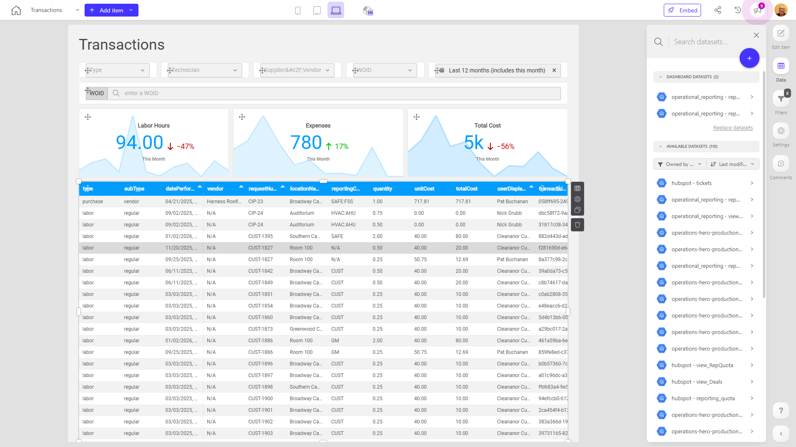

# Transactions

**Collections:** Client Dashboards, Production Dashboards

## Screenshot

## Description

This Transactions dashboard is a comprehensive reporting tool designed to provide business leaders and operational teams with a deep understanding of the company's financial transactions and labor activities.

The dashboard consolidates data from multiple sources, allowing users to analyze transactions across various dimensions such as transaction type, technician, supplier/vendor, and work order ID (WOID). The extensive use of dropdown filters, date filters, and search capabilities enables users to quickly slice and dice the data to answer specific questions.

Key insights surfaced by the dashboard include:

- Monthly labor hours, expenses, and overall transaction volume trends over time, providing visibility into operational performance.
- Detailed breakdowns of labor hours by location, technician, and transaction type, enabling better resource planning and cost management.
- A comprehensive transactions view with the ability to drill down into individual records, supporting auditing and reconciliation efforts.

This dashboard would be valuable for finance teams monitoring budgets and expenses, operations managers optimizing labor utilization, and procurement leaders evaluating supplier performance. By consolidating diverse transaction data into a single, interactive interface, it empowers users across the organization to make more informed, data-driven decisions.

## AI-Generated Summary

This Transactions dashboard provides a comprehensive view of the company's financial transactions and labor activities, enabling business leaders and operational teams to gain deep insights and make informed, data-driven decisions. The dashboard consolidates data from multiple sources, allowing users to analyze transactions across various dimensions such as transaction type, technician, supplier/vendor, and work order ID. The extensive use of filters, date ranges, and search capabilities empowers users to quickly slice and dice the data to answer specific questions. Key insights include monthly labor hours, expenses, and overall transaction volume trends over time, detailed breakdowns of labor hours by location and technician, and a comprehensive transactions view with the ability to drill down into individual records. This dashboard would be valuable for finance teams monitoring budgets and expenses, operations managers optimizing labor utilization, and procurement leaders evaluating supplier performance.

### Tags

`transactions` `finance` `operations` `reporting` `business intelligence`

---

*Generated on 2026-01-29 12:44:51 by Luzmo API Tools*