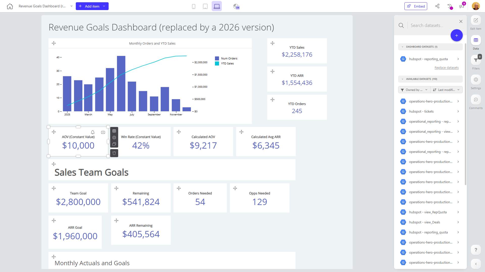

# Revenue Goals Dashboard (replaced by a 2026 version)

**Collections:** None

## Screenshot

## Description

The Revenue Goals Dashboard is a comprehensive reporting tool that provides key stakeholders with a detailed overview of the company's financial performance and progress towards revenue targets. This dashboard is designed to help executives, sales leaders, and finance teams track and analyze critical revenue metrics, identify trends, and make informed decisions to drive business growth.

The dashboard consists of 108 components, including a mix of evolution-number charts, pivot tables, text elements, line charts, and combination charts. These components display a range of revenue-related metrics, such as:

1. Monthly Orders and YTD Sales: A combination chart that tracks the company's monthly order volume and year-to-date (YTD) sales performance, providing a visual representation of sales trends.
2. YTD Sales, YTD ARR, and YTD S: Evolution-number components that display the company's year-to-date sales, annual recurring revenue (ARR), and other revenue-related key performance indicators (KPIs).
3. Calculated Avg ARR: An evolution-number component that showcases the company's average ARR, a crucial metric for understanding the recurring revenue stream.
4. Team Goal: An evolution-number component that displays the revenue target set for the team, allowing users to track progress against this goal.
5. Sales and ARR: Pivot tables that provide a detailed breakdown of sales and ARR data, enabling users to analyze performance at a more granular level.
6. Quarterly Actuals and Sales Goals: Pivot tables that compare the company's actual quarterly sales performance against the established sales goals, highlighting areas where targets are being met or exceeded.

The dashboard is designed to answer key questions for revenue-focused stakeholders, such as:
- How is the company performing against its overall revenue targets?
- What are the trends in monthly order volume and year-to-date sales?
- How is the company's ARR evolving over time, and how does it compare to the team's goals?
- What are the sales and ARR numbers at a more detailed level, such as by quarter or other relevant dimensions?

By providing a centralized and data-driven view of the company's revenue performance, this dashboard empowers executives, sales leaders, and finance teams to make informed decisions, identify growth opportunities, and take targeted actions to achieve their revenue goals.

## AI-Generated Summary

The Revenue Goals Dashboard provides a comprehensive overview of the company's financial performance and progress towards revenue targets. It empowers executives, sales leaders, and finance teams to track and analyze critical revenue metrics, identify trends, and make informed decisions to drive business growth. The dashboard displays a range of revenue-related metrics, including monthly orders, year-to-date sales, annual recurring revenue (ARR), and team revenue goals, presented through a variety of visualizations such as combination charts, evolution-number components, and pivot tables. This centralized and data-driven view allows users to monitor the company's overall revenue performance, identify growth opportunities, and take targeted actions to achieve their revenue goals.

### Tags

`revenue management` `financial reporting` `sales performance` `business intelligence` `data-driven decision making`

---

*Generated on 2026-01-29 12:48:11 by Luzmo API Tools*