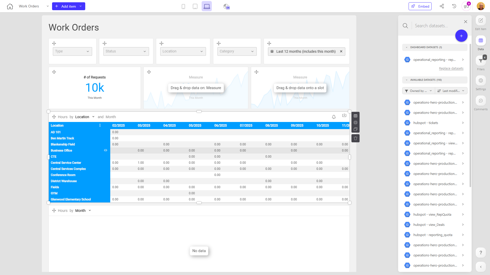

# Work Orders

**Collections:** None

## Screenshot

## Description

This "Work Orders" dashboard provides a comprehensive view of an organization's work order management processes. It is designed to assist operations, maintenance, and service teams in tracking, analyzing, and optimizing the execution of work orders.

The dashboard includes a variety of components that allow users to:

1. Filter and search work orders by key criteria such as type, technician, supplier/vendor, and work order ID (WOID).
2. View and analyze work order details, including transaction dates, labor hours, and expenses.
3. Examine labor hour trends by location using pivot table visualizations.
4. Access detailed work order data through interactive tables.

The combination of filtering options, performance metrics, and data tables enables users to answer critical questions, such as:
- What types of work orders are being generated, and by whom?
- How efficiently are work orders being completed in terms of labor hours and costs?
- Are there any trends or patterns in work order activity across different locations?

This dashboard would be valuable for managers, supervisors, and team members responsible for work order planning, assignment, and performance tracking. By providing a centralized and interactive view of work order data, it helps these stakeholders make informed decisions, identify areas for improvement, and optimize the overall work order management process.

## AI-Generated Summary

This "Work Orders" dashboard provides a comprehensive view of an organization's work order management processes, empowering operations, maintenance, and service teams to track, analyze, and optimize work order execution. The dashboard allows users to filter and search work orders by key criteria, view detailed transaction data, examine labor hour trends by location, and access interactive tables of work order information. This helps managers, supervisors, and team members answer critical questions about work order types, efficiency, and performance, enabling them to make informed decisions and improve the overall work order management process.

### Tags

`work orders` `operations management` `maintenance tracking` `data analysis` `performance optimization`

---

*Generated on 2026-01-29 12:42:19 by Luzmo API Tools*