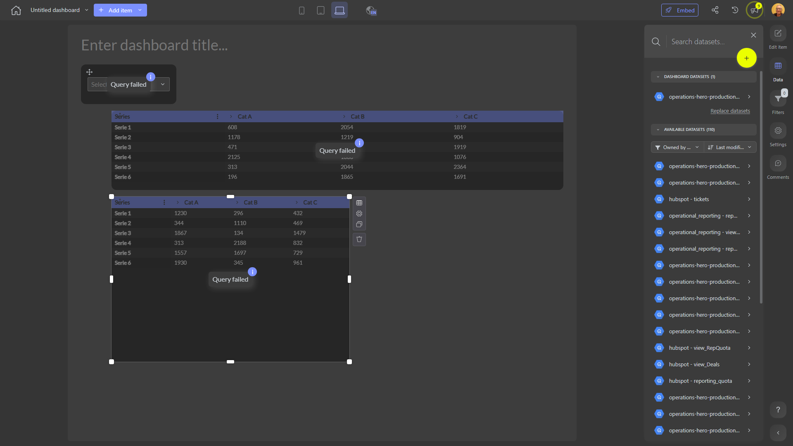

# 

**Collections:** None

## Screenshot

## Description

This dashboard provides a comprehensive view of key business metrics and insights, enabling data-driven decision making for the organization. Without a specific name or description, the dashboard appears to be a versatile tool that caters to the needs of various stakeholders.

At the core of the dashboard are six pivot tables, which allow users to explore and analyze data from multiple angles. The pivot tables likely display important performance indicators, trends, and comparisons across different business dimensions, such as product categories, customer segments, or regional sales.

To complement the pivot tables, the dashboard also includes three dropdown filters. These filters empower users to quickly slice and dice the data, enabling them to focus on specific areas of interest, such as time periods, geographic regions, or product lines. By adjusting the filters, users can generate customized views and gain deeper insights into the business.

The connected dataset suggests that the dashboard draws from a single, comprehensive data source, providing a centralized and holistic view of the organization's performance. This integrated approach helps users to identify patterns, uncover underlying drivers, and make informed decisions.

Overall, this dashboard is a powerful tool that can be utilized by various stakeholders, including executives, managers, and analysts, to monitor the health of the business, identify growth opportunities, and support strategic planning. Its flexible design and interactive features make it a valuable asset for data-driven decision making and performance management.

## AI-Generated Summary

This comprehensive dashboard provides executives, managers, and analysts with a centralized view of key business metrics and insights. The six pivot tables enable users to explore and analyze critical performance indicators, trends, and comparisons across product categories, customer segments, and regional sales. The three dropdown filters empower users to quickly slice and dice the data, allowing them to focus on specific areas of interest and generate customized views. By drawing from a single, integrated data source, this dashboard offers a holistic perspective on the organization's performance, helping stakeholders identify growth opportunities, uncover underlying drivers, and make informed, data-driven decisions to support strategic planning and business growth.

### Tags

`business intelligence` `performance management` `data-driven decision making` `executive dashboard` `operational analytics`

---

*Generated on 2026-01-29 12:45:10 by Luzmo API Tools*