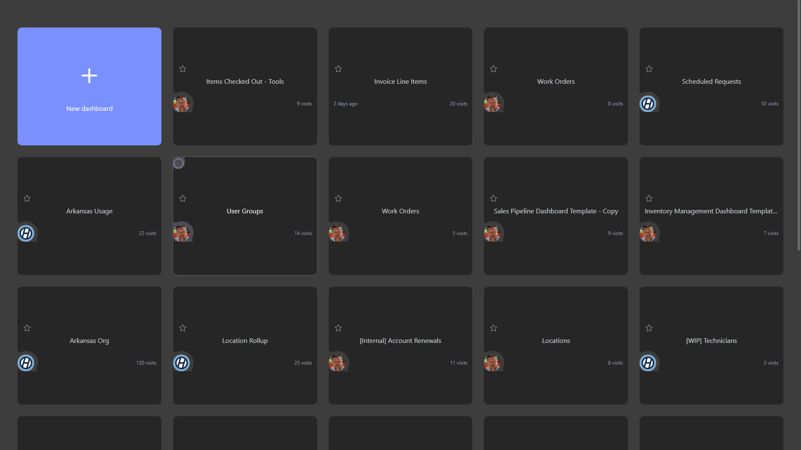

# Invoice Line Items

**Collections:** Production Dashboards

## Screenshot

## Description

This "Invoice Line Items" dashboard provides a comprehensive view of a company's invoicing data, enabling finance and sales teams to monitor key metrics, analyze trends, and identify opportunities for improvement.

The dashboard features a variety of interactive components that allow users to filter and search the invoice data:

- Date filters to view invoices sent within a specific timeframe
- Dropdown filters to analyze invoices by status, number, venue, and customer group
- A search function to quickly find invoices by event or other criteria

The core of the dashboard is a series of regular tables that display the detailed line items for each invoice, allowing users to drill down into the specifics of each transaction.

Complementing the tabular data, the dashboard includes several "evolution number" components that track key metrics over time, such as total invoiced amounts or volume of invoices. These visualizations help users identify trends and patterns in the company's invoicing performance.

This dashboard would be highly valuable for finance teams responsible for invoice processing and accounts receivable, as well as sales managers who need to monitor the performance of their customer accounts and identify areas for improvement. The ability to filter, search, and analyze invoice data in a centralized location helps these stakeholders make more informed decisions and optimize the company's invoicing and billing processes.

## AI-Generated Summary

This "Invoice Line Items" dashboard provides a comprehensive view of a company's invoicing data, enabling finance and sales teams to monitor key metrics, analyze trends, and identify opportunities for improvement. The dashboard features a variety of interactive components that allow users to filter and search the invoice data by date, status, number, venue, and customer group, as well as quickly find invoices by event or other criteria. The core of the dashboard is a series of detailed tables displaying line items for each invoice, complemented by visualizations tracking key invoicing metrics over time. This dashboard would be highly valuable for finance teams responsible for invoice processing and accounts receivable, as well as sales managers monitoring customer account performance and optimizing invoicing and billing processes.

### Tags

`invoicing` `finance` `sales` `accounts receivable` `billing`

---

*Generated on 2026-01-29 12:42:06 by Luzmo API Tools*