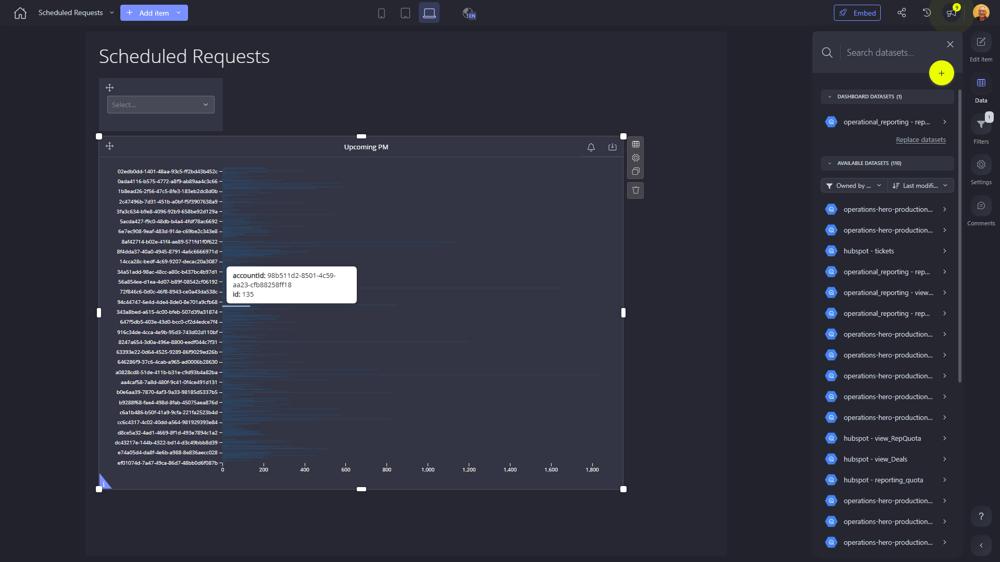

# Scheduled Requests

**Collections:** None

## Screenshot

## Description

The "Scheduled Requests" dashboard provides a comprehensive overview of upcoming preventive maintenance (PM) tasks for an organization. This dashboard is likely used by maintenance and operations teams to proactively plan and manage their scheduled work.

The dashboard consists of six components, including three selectboxes and three bar charts. The selectboxes allow users to filter and search the data, likely by factors such as asset type, location, or priority. The bar charts then display the upcoming PM work in a visual format.

The "Upcoming PM" bar charts appear to be the core of the dashboard, showing the volume and timing of scheduled PM tasks. This information can help maintenance teams ensure they have the necessary resources and capacity to complete this work on time.

Additionally, the "Search & Select" components suggest the dashboard allows users to quickly find and focus on specific areas of interest, enabling more targeted planning and analysis.

Overall, this dashboard is a valuable tool for maintenance and operations professionals who need to proactively manage their scheduled work and ensure the reliability and availability of their assets. By providing a centralized view of upcoming PM tasks, it supports data-driven decision-making and helps organizations optimize their maintenance activities.

## AI-Generated Summary

The "Scheduled Requests" dashboard provides maintenance and operations teams with a comprehensive overview of upcoming preventive maintenance (PM) tasks. This dashboard helps these teams proactively plan and manage their scheduled work by allowing them to filter and search for specific assets, locations, or priorities. The visual bar charts display the volume and timing of the scheduled PM tasks, enabling better resource allocation and capacity planning. This dashboard supports data-driven decision-making and helps organizations optimize their maintenance activities, ensuring the reliability and availability of their assets.

### Tags

`preventive maintenance` `asset management` `work order scheduling` `operations planning` `maintenance optimization`

---

*Generated on 2026-01-29 12:42:11 by Luzmo API Tools*