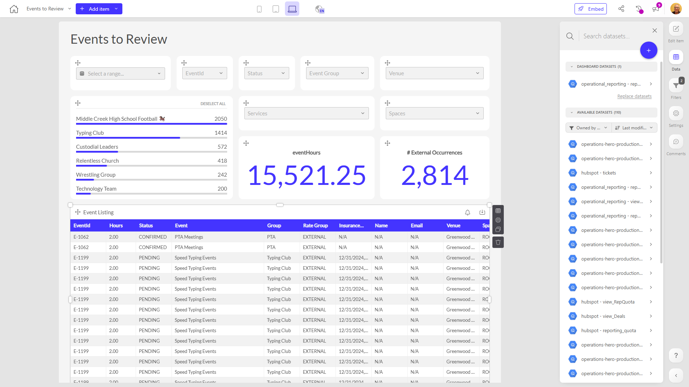

# Events to Review

**Collections:** Client Dashboards, Production Dashboards

## Screenshot

## Description

The "Events to Review" dashboard provides a comprehensive view of upcoming and ongoing events for an organization. It is likely used by event managers, coordinators, and other stakeholders responsible for planning, monitoring, and reporting on the organization's event activities.

The dashboard contains a wide range of components that allow users to filter, analyze, and track various aspects of the events:

- Date filters, dropdown filters, and slicer filters enable users to narrow down the events by start date, status, event group, venue, and internal/external classification.
- Regular tables display detailed information about the event listings, services, and spaces, providing a structured view of the event data.
- Evolution number components track key metrics such as total event hours and the number of external event occurrences, allowing users to monitor trends and changes over time.

With 39 components in total, this dashboard offers a rich and interactive experience for users to explore and understand the organization's event landscape. The dashboard is connected to a single dataset and has one parameter, suggesting that users can potentially customize or configure the dashboard to suit their specific needs and preferences.

Overall, the "Events to Review" dashboard serves as a valuable tool for event managers and stakeholders, enabling them to effectively plan, coordinate, and report on the organization's events, ensuring smooth execution and informed decision-making.

## AI-Generated Summary

The "Events to Review" dashboard provides a comprehensive view of upcoming and ongoing events for an organization. It enables event managers, coordinators, and stakeholders to effectively plan, coordinate, and report on the organization's event activities. The dashboard offers a rich and interactive experience, allowing users to filter, analyze, and track various aspects of the events, including start dates, status, event groups, venues, and internal/external classification. With a wide range of components, such as tables, filters, and evolution numbers, this dashboard helps users monitor key metrics, identify trends, and make informed decisions to ensure smooth event execution.

### Tags

`event management` `event planning` `event reporting` `event monitoring` `event analytics`

## Filters

This dashboard has **3 interactive filters**:

- **Filter 1** (slicer-filter)
- **Filter 2** (slicer-filter)
- **Filter 3** (slicer-filter)

---

*Generated on 2026-01-29 12:46:30 by Luzmo API Tools*