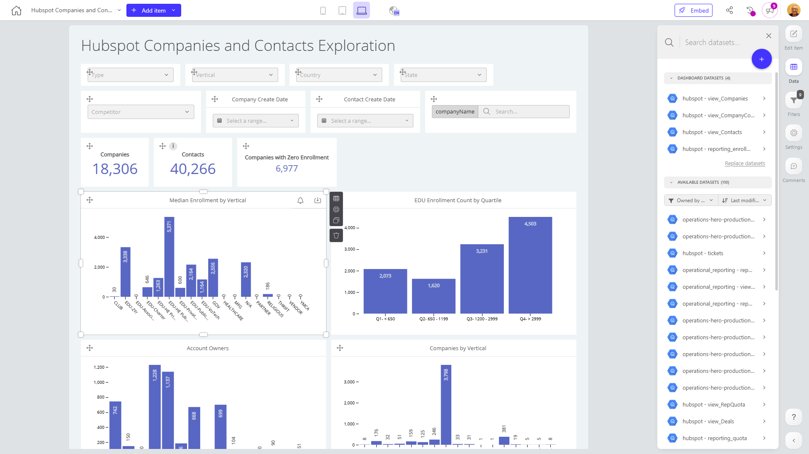

# Hubspot Companies and Contacts Exploration

**Collections:** Internal

## Screenshot

## Description

This HubSpot Companies and Contacts Exploration dashboard is designed to provide a comprehensive view of a company's customer base and sales pipeline. It brings together data on companies and contacts, allowing users to analyze key metrics and trends across these two important areas.

The dashboard features a range of components that enable users to filter, visualize, and explore the data in depth:

- Dropdown filters allow users to slice the data by various attributes such as company vertical, contact create date, and more.
- Date filters let users examine trends over time for both companies and contacts.
- Search functionality enables users to quickly find specific companies or contacts of interest.
- Evolution numbers track key metrics like total enrollment and companies with zero enrollment.
- Column charts visualize important statistics like median enrollment by vertical and enrollment count by quartile.
- Donut charts break down the client base by vertical.
- Regular tables provide detailed views of company and contact information.
- Pivot tables offer deeper analysis of vertical-specific metrics.

This dashboard would be valuable for sales, marketing, and account management teams who need to understand their customer landscape, identify opportunities, and monitor key performance indicators. The breadth of data and analytical capabilities empowers users to uncover insights that can drive strategic decision-making and improve customer engagement.

## AI-Generated Summary

This HubSpot Companies and Contacts Exploration dashboard provides a comprehensive view of a company's customer base and sales pipeline. It brings together data on companies and contacts, enabling users to analyze key metrics and trends across these two critical areas. The dashboard features a range of components that allow users to filter, visualize, and explore the data in depth, uncovering insights that can drive strategic decision-making and improve customer engagement. This dashboard would be valuable for sales, marketing, and account management teams who need to understand their customer landscape, identify opportunities, and monitor key performance indicators.

### Tags

`hubspot` `crm` `customer analysis` `sales pipeline` `business intelligence`

---

*Generated on 2026-01-29 12:44:11 by Luzmo API Tools*