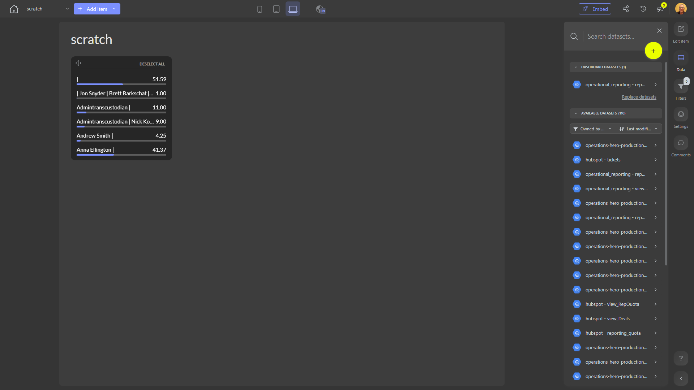

# scratch

**Collections:** None

## Screenshot

## Description

This "scratch" dashboard appears to be a tool for analyzing and exploring some form of ranking or categorization data. Based on the metadata provided, the dashboard contains three "slicer-filter" components, all named "Rank slicer filter."

Slicer filters are interactive dashboard components that allow users to select and filter data based on specific criteria. In this case, the three rank slicer filters suggest that the dashboard is designed to enable users to explore and compare different ranked or categorized data points.

Without any additional context about the specific data or business domain, it's difficult to determine the exact purpose of this dashboard. However, it's reasonable to assume that it could be used by analysts, managers, or decision-makers who need to understand and explore ranking-based data, such as sales performance, customer segmentation, or product rankings.

The dashboard connects to a single dataset, which likely contains the underlying data being analyzed and visualized. Users of this dashboard would be able to interact with the rank slicer filters to drill down, compare, and gain insights into the ranking-based information relevant to their specific needs or areas of interest.

Overall, this "scratch" dashboard appears to be a tool for exploring and understanding ranking-based data, providing users with the ability to slice and filter the data in meaningful ways to support their analysis and decision-making processes.

## AI-Generated Summary

This "scratch" dashboard is a tool for analyzing and exploring ranking or categorization data. It provides users, such as analysts, managers, or decision-makers, with the ability to slice and filter ranked data using three interactive "rank slicer filter" components. This allows them to drill down, compare, and gain insights into the ranking-based information relevant to their specific needs or areas of interest. The dashboard could be used to support analysis and decision-making processes in various business domains where understanding and interpreting ranking-based data is crucial, such as sales performance, customer segmentation, or product rankings.

### Tags

`ranking` `data analysis` `decision support` `data exploration` `performance management`

## Filters

This dashboard has **3 interactive filters**:

- **Filter 1** (slicer-filter)
- **Filter 2** (slicer-filter)
- **Filter 3** (slicer-filter)

---

*Generated on 2026-01-29 12:45:57 by Luzmo API Tools*