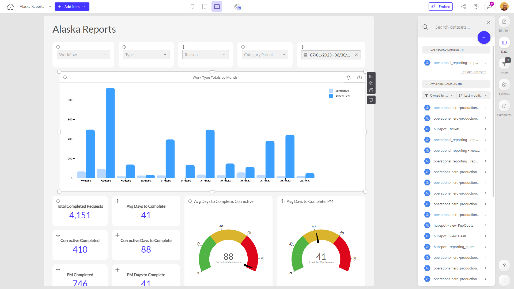

# Alaska Reports

**Collections:** None

## Screenshot

## Description

The Alaska Reports dashboard provides a comprehensive view of key metrics and performance indicators related to work requests and completion in Alaska. This dashboard is likely used by managers, supervisors, and other stakeholders involved in overseeing and optimizing the work request and fulfillment process.

The dashboard contains a total of 69 components, including:
- 30 dropdown filters that allow users to select and filter data by various criteria such as work type, location, and other factors
- 18 evolution number components that display trends over time for metrics like total completed requests and average days to complete
- 6 speedometer charts that show performance against targets for average days to complete for corrective and preventive maintenance work
- 3 date filters to select specific time periods
- 3 column charts visualizing work type totals by month
- 3 pivot tables providing detailed breakdowns of the data
- 3 sunburst charts offering a hierarchical view of the data
- 3 regular tables displaying raw data

The dashboard appears to draw from a single connected dataset and has one parameter, likely allowing users to adjust the timeframe or other high-level settings.

This dashboard would be valuable for Alaska-based operations and maintenance teams, as well as managers and executives who need to monitor and analyze the performance of the work request and completion process. It provides insights into productivity, efficiency, and service levels that can inform decision-making and drive continuous improvement.

## AI-Generated Summary

The Alaska Reports dashboard provides a comprehensive view of key metrics and performance indicators related to work requests and completion in Alaska. This dashboard is likely used by managers, supervisors, and other stakeholders involved in overseeing and optimizing the work request and fulfillment process. The dashboard offers insights into productivity, efficiency, and service levels that can inform decision-making and drive continuous improvement for Alaska-based operations and maintenance teams.

### Tags

`work orders` `maintenance` `operations` `performance management` `alaska`

---

*Generated on 2026-01-29 12:43:07 by Luzmo API Tools*