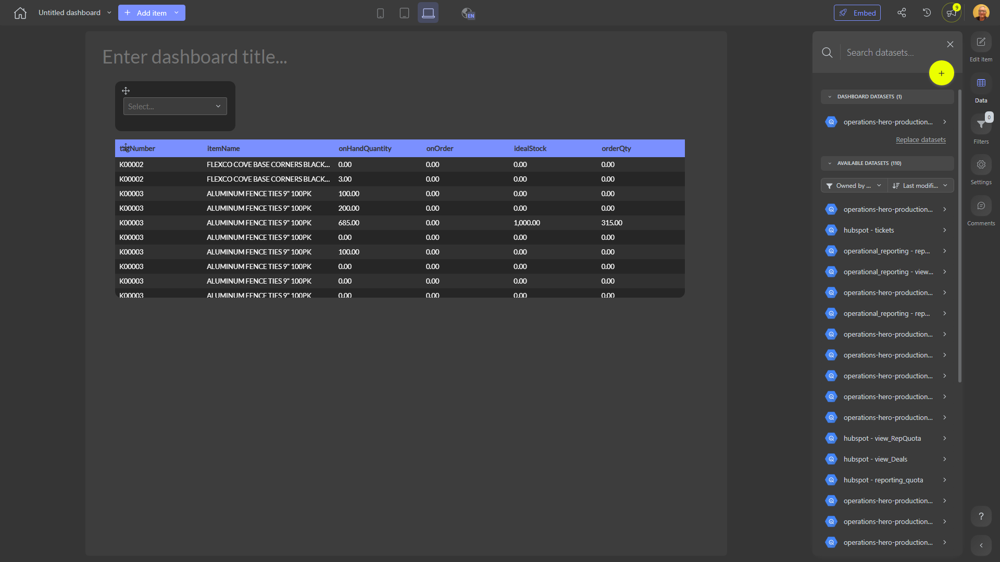

# 

**Collections:** None

## Screenshot

## Description

This dashboard provides a comprehensive view of key data and insights for business stakeholders. It consists of six components, including three dropdown filters and three regular tables, all connected to a single dataset.

The dropdown filters allow users to easily narrow down and segment the data based on specific criteria. This enables them to quickly focus on the areas of greatest interest or concern.

The regular tables then display the relevant data in a structured and easy-to-read format. These tables likely provide details on important metrics, trends, or performance indicators that are crucial for understanding the business's current state and identifying opportunities for improvement.

Together, the filters and tables empower users to explore the data, uncover insights, and make more informed decisions. This dashboard would be particularly useful for managers, analysts, or executives who need to regularly monitor and analyze the business's performance across key areas.

By providing a centralized, interactive view of the data, this dashboard helps streamline reporting, accelerate decision-making, and drive better business outcomes. Users can leverage the flexible filtering options to dive deeper into the data and uncover the specific insights needed to address their unique business challenges and objectives.

## AI-Generated Summary

This comprehensive business dashboard provides key data and insights to help stakeholders monitor and analyze the company's performance across critical areas. By leveraging flexible filtering options and structured data tables, users can quickly identify trends, uncover opportunities, and make more informed decisions. Managers, analysts, and executives can use this dashboard to streamline reporting, accelerate decision-making, and drive better business outcomes.

### Tags

`business performance` `data insights` `decision support` `reporting and analytics` `stakeholder monitoring`

---

*Generated on 2026-01-29 11:52:27 by Luzmo API Tools*