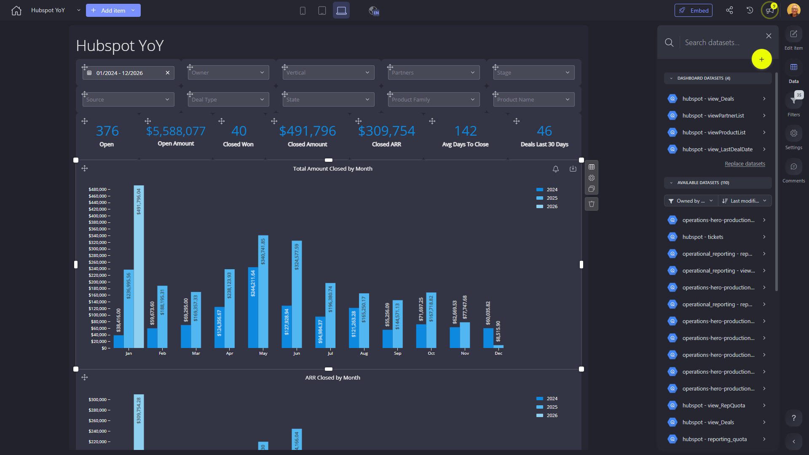

# Hubspot YoY

**Collections:** None

## Screenshot

## Description

The Hubspot YoY dashboard is a comprehensive reporting tool designed to help Hubspot teams and managers analyze the company's year-over-year sales performance. This dashboard provides a wide range of visualizations and metrics to track key sales metrics, identify trends, and uncover insights that can drive business decisions.

The dashboard features 120 components, including:

- Dropdown filters to allow users to segment and analyze data by various dimensions such as product, region, sales team, etc.
- Evolution number components to track crucial metrics like open deals, closed deals, closed ARR, and average time to close.
- Column charts to visualize monthly trends in total closed amount and ARR.
- Regular tables and pivot tables to provide detailed, interactive views of the underlying sales data.
- Additional chart types like funnels, donut charts, and combination charts to give users a comprehensive understanding of the sales pipeline and performance.

The dashboard is connected to 4 datasets, allowing users to analyze data from multiple sources within a single, centralized view. This empowers Hubspot sales leaders, managers, and analysts to quickly identify areas of strength and opportunities for improvement, make data-driven decisions, and track the company's sales performance over time.

Overall, this Hubspot YoY dashboard serves as a powerful analytical tool that enables teams to monitor key sales metrics, uncover trends, and gain valuable insights to drive business growth and success.

## AI-Generated Summary

The Hubspot YoY dashboard is a comprehensive sales performance reporting tool designed to help Hubspot teams and managers track and analyze the company's year-over-year sales trends. This dashboard provides a wide range of visualizations and metrics to monitor key sales indicators, identify performance trends, and uncover insights to drive strategic business decisions. It empowers sales leaders, managers, and analysts to quickly understand the sales pipeline, identify areas of strength and opportunities for improvement, and track the company's sales performance over time. With its interactive filters, charts, and tables, this dashboard delivers a centralized view of sales data from multiple sources, enabling data-driven decision-making to support Hubspot's growth and success.

### Tags

`sales` `performance` `analytics` `business intelligence` `data-driven decision making`

## Filters

This dashboard has **3 interactive filters**:

- **Filter 1** (slicer-filter)
- **Filter 2** (slicer-filter)
- **Filter 3** (slicer-filter)

---

*Generated on 2026-01-29 12:47:34 by Luzmo API Tools*