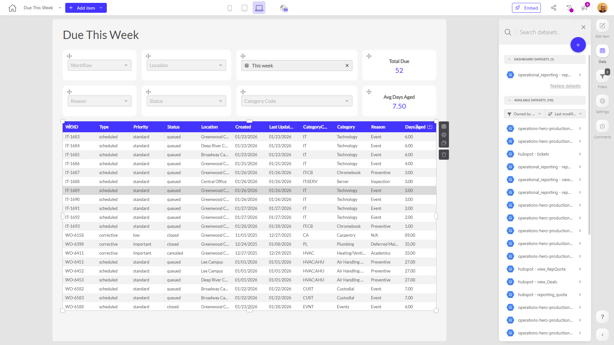

# Due This Week

**Collections:** Client Dashboards, Production Dashboards

## Screenshot

## Description

The "Due This Week" dashboard is designed to provide a comprehensive view of upcoming tasks and deadlines for a specific organization or team. The dashboard features a variety of components that allow users to filter, analyze, and monitor the status of their work.

The key components of the dashboard include:

1. Search & Select filters: These dropdown-style filters allow users to quickly search and select specific criteria, such as projects, teams, or assignees, to narrow down the information displayed.

2. Date filters: The date-filter components enable users to select specific date ranges, allowing them to focus on tasks and deadlines due within a given time frame.

3. Evolution-number components: These components display dynamic, evolving numerical values, such as the total number of due tasks or other key metrics, providing users with a high-level overview of the current status.

4. Data tables: The regular-table components present detailed information about the tasks or items due, including attributes like due dates, assignees, and other relevant details.

This dashboard is likely used by project managers, team leaders, or anyone responsible for tracking and managing upcoming work and deliverables. By providing a centralized view of due tasks and deadlines, the dashboard helps users stay organized, prioritize their efforts, and ensure that critical work is completed on time.

Overall, the "Due This Week" dashboard serves as a valuable tool for maintaining visibility, monitoring progress, and proactively addressing potential issues or bottlenecks in the organization's workflow.

## AI-Generated Summary

The "Due This Week" dashboard provides a comprehensive view of upcoming tasks and deadlines for an organization or team, enabling users to effectively manage their work. It allows users to filter, analyze, and monitor the status of tasks through various components, including search and select filters, date filters, and data tables. This dashboard is particularly useful for project managers, team leaders, and anyone responsible for tracking and managing upcoming work and deliverables. By offering a centralized view of due tasks and deadlines, the dashboard helps users stay organized, prioritize their efforts, and ensure critical work is completed on time, ultimately improving the team's productivity and performance.

### Tags

`task management` `project management` `deadline tracking` `work planning` `team productivity`

---

*Generated on 2026-01-29 12:45:48 by Luzmo API Tools*