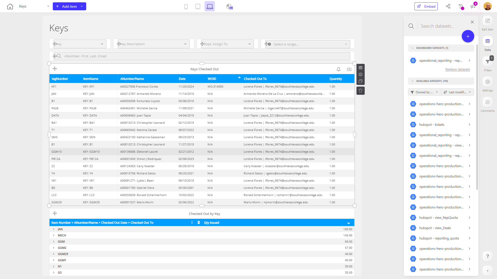

# Keys

**Collections:** Client Dashboards, Production Dashboards

## Screenshot

## Description

This "Keys" dashboard appears to be a comprehensive tool for managing and tracking the usage of physical keys within an organization. Based on the component types and names, this dashboard likely provides the following key functionality:

1. Filtering and Searching: The dashboard includes various dropdown filters, date filters, and a search filter to allow users to quickly find and analyze data on specific keys, their descriptions, assigned owners, and checkout history.

2. Tracking Key Checkouts: The dashboard features two regular tables that display detailed information on keys that have been checked out, including who they were checked out by and when.

3. Pivot Table Analysis: The dashboard includes two pivot tables that provide high-level, summarized views of key checkout activity, broken down by the key itself and the person who checked it out. This allows users to quickly identify usage patterns and potential issues.

This dashboard would be most useful for employees responsible for managing and overseeing a company's physical key inventory, such as facility or security managers. It enables them to easily monitor key usage, identify any potential misplacement or unauthorized access, and make data-driven decisions to improve key management processes.

The combination of filtering, tabular, and analytical capabilities in this dashboard helps to consolidate key-related information into a single, comprehensive view, empowering users to efficiently track, investigate, and report on the organization's key management activities.

## AI-Generated Summary

This "Keys" dashboard provides a comprehensive solution for managing and tracking the usage of physical keys within an organization. It enables facility or security managers to efficiently monitor key inventory, identify any potential misplacement or unauthorized access, and make data-driven decisions to improve key management processes. The dashboard features robust filtering, searching, and analytical capabilities, allowing users to quickly find and analyze data on specific keys, their descriptions, assigned owners, and checkout history. With detailed tables and pivot tables, this dashboard consolidates key-related information into a single view, empowering users to track, investigate, and report on the organization's key management activities.

### Tags

`key management` `facility management` `physical inventory` `access control` `security`

---

*Generated on 2026-01-29 12:45:21 by Luzmo API Tools*