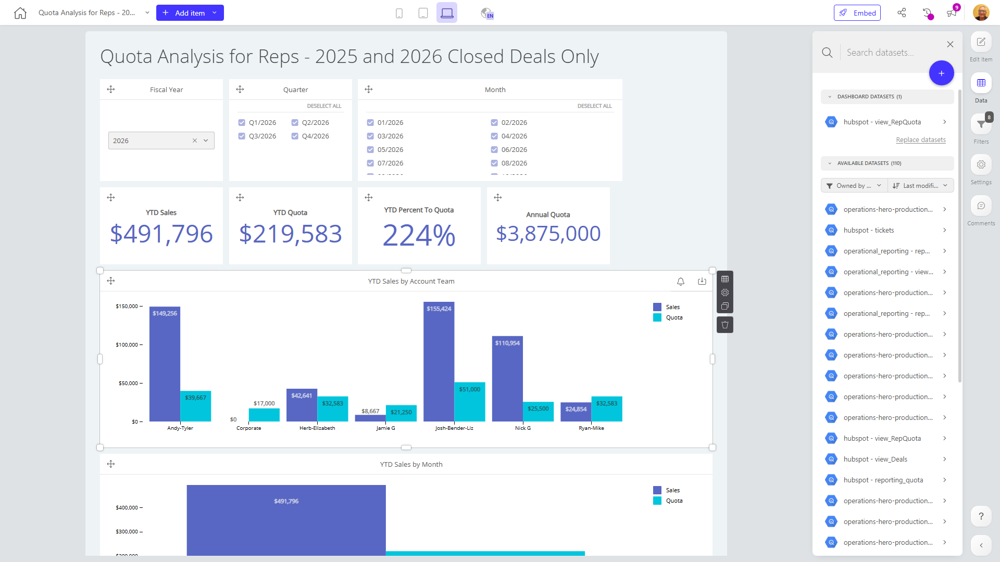

# Quota Analysis for Reps - 2025 and 2026 Closed Deals Only

**Collections:** None

## Screenshot

## Description

This dashboard, titled "Quota Analysis for Reps - 2025 and 2026 Closed Deals Only", is designed to provide sales managers and executives with a comprehensive view of their team's quota performance for the current fiscal year.

The dashboard is composed of 48 components, including evolution numbers, text elements, pivot tables, filters, column charts, and bullet charts. This variety of visualizations and analytical tools suggests that the dashboard is intended to offer a deep dive into sales quota attainment, trends, and performance.

Key components of the dashboard include:
- Fiscal year, quarter, and month filters to allow for dynamic analysis of sales data
- Evolution numbers tracking year-to-date (YTD) quota, sales, and quota attainment percentage
- Column charts displaying YTD sales by account team and by month
- Pivot tables providing detailed breakdowns of sales performance data
- A bullet chart showcasing YTD performance against quota

By providing sales managers and executives with this comprehensive view of quota attainment and sales performance, the dashboard likely helps them identify areas for improvement, recognize top-performing teams and individuals, and make data-driven decisions to optimize sales strategies and resource allocation. The focus on closed deals from 2025 and 2026 suggests that the dashboard is intended for long-term sales planning and analysis, rather than real-time monitoring.

Overall, this dashboard appears to be a valuable tool for sales leaders to track, analyze, and optimize their team's quota achievement and overall sales performance.

## AI-Generated Summary

This sales performance dashboard provides sales managers and executives with a comprehensive view of their team's quota attainment for the current fiscal year. It allows users to track and analyze sales data, identify top-performing teams and individuals, and make data-driven decisions to optimize sales strategies and resource allocation. The dashboard includes visualizations such as evolution numbers, column charts, pivot tables, and a bullet chart, enabling users to deeply understand sales quota achievement, trends, and performance. With dynamic filtering by fiscal year, quarter, and month, the dashboard supports long-term sales planning and analysis, helping sales leaders identify areas for improvement and ensure their team is on track to meet their sales goals.

### Tags

`sales performance` `quota analysis` `sales management` `data-driven decision making` `business intelligence`

## Filters

This dashboard has **6 interactive filters**:

- **Filter 1** (slicer-filter)
- **Filter 2** (slicer-filter)
- **Filter 3** (slicer-filter)
- **Filter 4** (slicer-filter)
- **Filter 5** (slicer-filter)
- **Filter 6** (slicer-filter)

---

*Generated on 2026-01-29 12:48:17 by Luzmo API Tools*