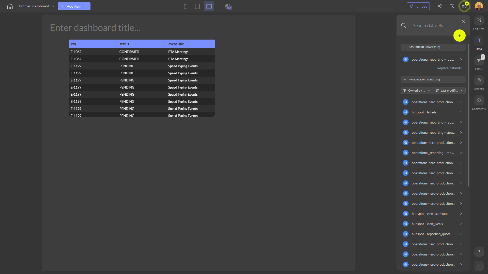

# 

**Collections:** None

## Screenshot

## Description

This dashboard appears to be designed for monitoring and analyzing some type of tabular data or reports. It contains three regular tables, which suggests it is likely displaying a collection of data records or information that is well-suited for presentation in a structured grid format.

Without any additional context about the specific data or business domain, it's difficult to determine the exact purpose of this dashboard. However, based on the available metadata, a few key things can be inferred:

1. The dashboard likely serves a general analytical or reporting purpose, as indicated by the presence of multiple tabular components. This suggests the dashboard is designed to provide users with a comprehensive view of relevant data.

2. The dashboard may allow users to explore and interact with the underlying data, as the presence of parameters implies the ability to filter, sort, or segment the information displayed in the tables.

3. The single connected dataset suggests the dashboard pulls from a single source of data, which could be a database, spreadsheet, or other structured data repository. This data source likely contains the core information needed to power the analytical views.

Overall, this dashboard seems intended to give users the ability to efficiently review and analyze tabular data, potentially across different dimensions or views. It could be useful for a variety of stakeholders, such as managers, analysts, or operational teams, who need to stay up-to-date on key metrics, trends, or performance indicators related to the organization's activities. The specific insights and value it provides would depend on the nature of the underlying data being displayed.

## AI-Generated Summary

This dashboard provides a comprehensive overview of key data and metrics, presented in a clear and structured manner. It allows users to efficiently review and analyze tabular information, potentially across different dimensions or views. The dashboard is likely useful for managers, analysts, and operational teams who need to stay up-to-date on important performance indicators, trends, and insights related to the organization's activities. By giving users the ability to interact with the data and filter or sort the information, this dashboard supports informed decision-making and helps stakeholders gain a deeper understanding of the business.

### Tags

`analytics` `reporting` `performance management` `data exploration` `business intelligence`

---

*Generated on 2026-01-29 11:53:37 by Luzmo API Tools*