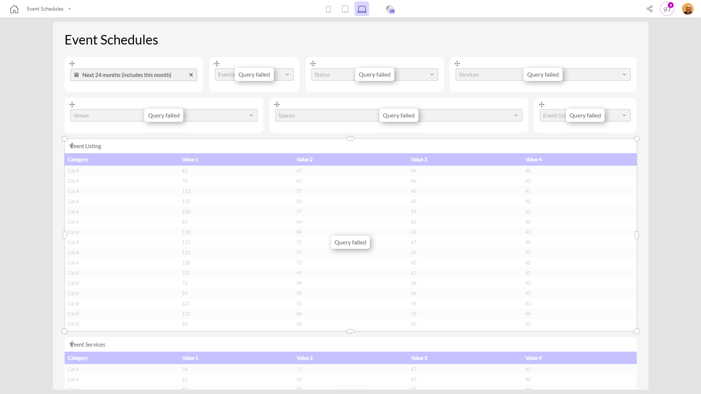

# Event Schedules

**Collections:** Production Dashboards

## Screenshot

## AI-Generated Summary

The Event Schedules dashboard provides a comprehensive view of upcoming events, allowing event organizers and managers to easily track and manage event details. It features a range of filtering options, such as event start date, status, venue, and event group, allowing users to quickly find and analyze relevant information. The dashboard includes several data visualizations, including tables that display event listings, services, and spaces, enabling users to gain insights into the various aspects of event planning and execution. This dashboard would be valuable for event management teams, venue coordinators, and other stakeholders who need to stay informed about upcoming events and ensure smooth event operations.

### Tags

`event management` `event scheduling` `event planning` `venue management` `operations`

---

*Generated on 2026-01-29 12:48:55 by Luzmo API Tools*