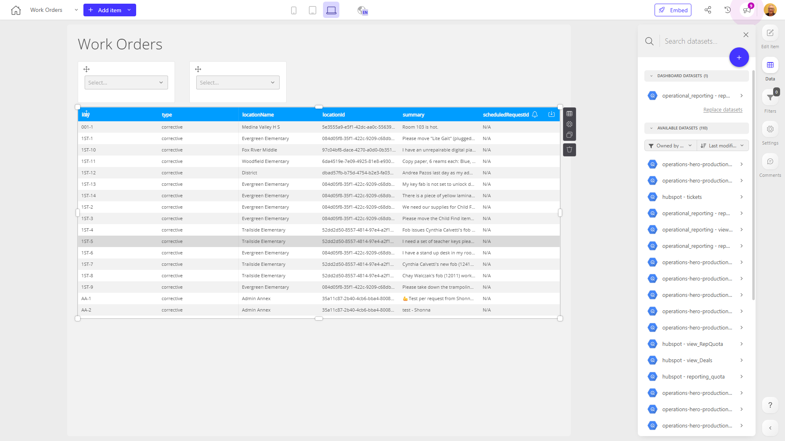

# Work Orders

**Collections:** None

## Screenshot

## Description

This "Work Orders" dashboard is designed to provide users with a comprehensive view and management of work orders within the organization. The dashboard consists of 9 components, primarily composed of 6 search and select dropdowns and 3 data tables.

The key features and functionality of this dashboard include:

1. Search & Select: The multiple search and select dropdowns allow users to filter and narrow down work orders based on various criteria, such as location, department, priority, or status. This enables users to quickly find and focus on the specific work orders they need to address.

2. Data Tables: The three data tables provide detailed information about the work orders, displaying key details like order number, description, assigned technician, and completion status. These tables allow users to review the current state of work orders, identify any outstanding or overdue tasks, and monitor the progress of ongoing work.

3. Holistic Work Order Management: By combining the filtering capabilities with the comprehensive data tables, this dashboard gives users a centralized view to manage the entire lifecycle of work orders. This can be valuable for maintenance teams, facilities managers, or operations personnel who need to track, prioritize, and resolve work orders efficiently.

The dashboard is connected to a single underlying dataset, likely containing the work order information, which powers the various components and enables users to access and analyze the relevant data.

Overall, this "Work Orders" dashboard is a useful tool for teams responsible for managing and executing work orders within the organization. It provides visibility, filtering, and monitoring capabilities to help users stay on top of maintenance tasks, identify bottlenecks, and optimize the work order process.

## AI-Generated Summary

This "Work Orders" dashboard provides a centralized view and management capabilities for teams responsible for executing and monitoring maintenance tasks across the organization. The dashboard's key features, including comprehensive search and filtering options as well as detailed data tables, enable users to quickly find, prioritize, and track the status of work orders. This helps maintenance teams, facilities managers, and operations personnel stay on top of outstanding tasks, identify bottlenecks, and optimize the overall work order process. With this dashboard, users can access a holistic overview of the organization's maintenance activities and make informed decisions to ensure efficient and timely resolution of work orders.

### Tags

`work orders` `maintenance` `facilities management` `operations` `task management`

---

*Generated on 2026-01-29 12:42:08 by Luzmo API Tools*