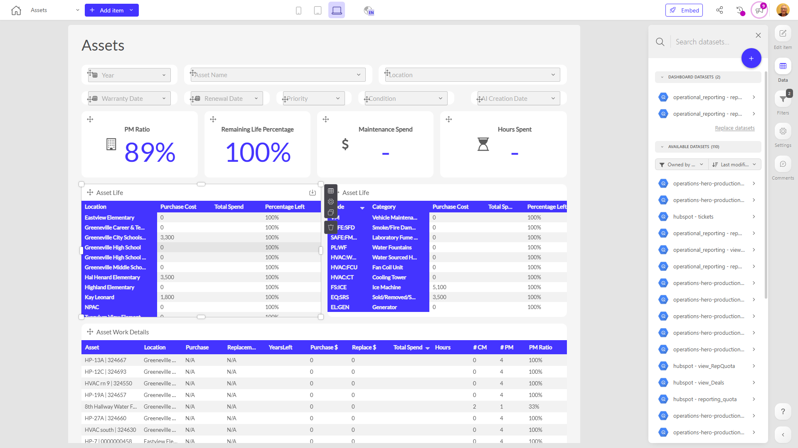

# Assets

**Collections:** Client Dashboards, Production Dashboards

## Screenshot

## Description

The "Assets" dashboard provides a comprehensive view of an organization's asset management operations. It is designed to help asset managers, maintenance teams, and operations leaders monitor and analyze key performance indicators related to asset utilization, maintenance, and work activities.

The dashboard includes a variety of interactive components, including:

- Dropdown filters to allow users to explore data by venue or event start date
- Evolution numbers that track metrics over time, such as maintenance costs, hours spent, and PM (preventative maintenance) ratio
- Pivot tables that provide detailed breakdowns of asset life
- Regular tables that list individual assets and their work details

By combining these various data visualizations and filtering options, the dashboard empowers users to answer critical questions, such as:

- How are maintenance costs and labor hours trending over time?
- Are we meeting our preventative maintenance targets?
- Which assets have the longest lifespans, and what factors contribute to their longevity?
- What work has been performed on each individual asset, and when?

This dashboard consolidates data from multiple sources, providing a holistic view of the organization's asset management performance. It would be a valuable tool for asset managers, maintenance supervisors, and operations leaders who need to make data-driven decisions to optimize asset utilization, reduce maintenance costs, and ensure reliable operations.

## AI-Generated Summary

The "Assets" dashboard provides a comprehensive view of an organization's asset management operations. It empowers asset managers, maintenance teams, and operations leaders to monitor and analyze key performance indicators related to asset utilization, maintenance, and work activities. The dashboard consolidates data from multiple sources, offering interactive components such as filters, evolution numbers, pivot tables, and detailed asset listings. Users can explore trends in maintenance costs, labor hours, preventative maintenance ratios, and asset life cycles to make data-driven decisions that optimize asset utilization, reduce maintenance expenses, and ensure reliable operations.

### Tags

`asset management` `maintenance` `operations` `performance monitoring` `work order management`

---

*Generated on 2026-01-29 11:54:23 by Luzmo API Tools*