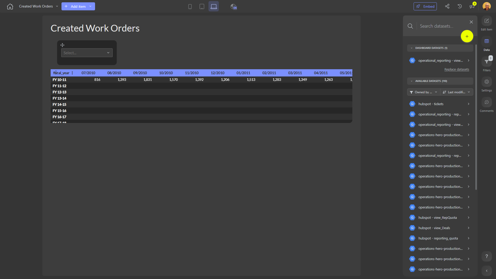

# Created Work Orders

**Collections:** None

## Screenshot

## Description

The "Created Work Orders" dashboard provides a comprehensive view of work orders for an organization. This dashboard is likely used by operations managers, project managers, or team leaders who need to track and analyze the status and progress of work orders.

The dashboard consists of six components:
1. Three dropdown filters that allow users to narrow down the data by specific criteria, such as work order type, status, or date range.
2. Three pivot tables that display detailed information about the work orders, such as the number of work orders created, the work order status, and the associated costs or resource utilization.

The dashboard is connected to a single dataset, which likely contains the core data about the organization's work orders, including details like work order ID, description, assigned resources, and completion status.

By using the dropdown filters and pivot tables, users can quickly identify trends, bottlenecks, or areas for improvement in the work order process. This dashboard can help managers make informed decisions, optimize resource allocation, and ensure timely completion of work orders. The insights provided by this dashboard can be valuable for various stakeholders, such as operations, project management, and executive leadership.

## AI-Generated Summary

The "Created Work Orders" dashboard provides a comprehensive overview of an organization's work order management. This dashboard is designed to help operations managers, project managers, and team leaders track and analyze the status, progress, and associated costs of work orders. By using the interactive filters and pivot tables, users can easily identify trends, bottlenecks, and areas for improvement in the work order process. This dashboard can support informed decision-making, optimize resource allocation, and ensure timely completion of work orders, ultimately enhancing the overall operational efficiency of the organization.

### Tags

`work order management` `operations analytics` `project management` `resource utilization` `business intelligence`

---

*Generated on 2026-01-29 12:43:57 by Luzmo API Tools*