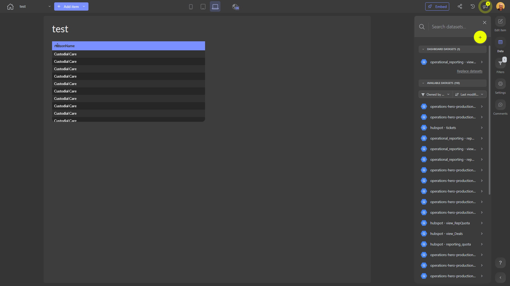

# test

**Collections:** None

## Screenshot

## Description

This dashboard, titled "test", provides a comprehensive view of data presented in a set of three regular tables. Without a specific description provided, the purpose of this dashboard seems to be to display tabular data for general analysis and review.

The three regular tables likely present different sets of information that can be useful for various stakeholders within the organization. Regular tables are a common component used to display structured data in a clear and organized manner, making it easy for users to review, compare, and draw insights from the information.

While the specific data and metrics shown in the tables are not known, this dashboard could potentially be used by various teams and departments to understand and analyze relevant data. For example, it may provide visibility into key performance indicators, operational data, or financial information that supports decision-making and problem-solving across the organization.

The presence of a single connected dataset and one parameter suggests that the dashboard may allow users to filter or explore the data in a specific way, potentially by selecting a date range, location, or other relevant dimension.

Overall, this "test" dashboard serves as a general-purpose data visualization tool that can be used by a wide range of stakeholders to access and analyze important information within the organization. The combination of three regular tables provides a flexible and customizable platform for users to gain insights and make informed decisions based on the data presented.

## AI-Generated Summary

This "test" dashboard provides a comprehensive view of key data presented in a set of three regular tables. While the specific data and metrics are not known, this dashboard likely serves as a flexible and customizable platform for users across the organization to access, analyze, and gain insights from important information. The combination of three regular tables allows stakeholders to review, compare, and draw insights from various data sources to support decision-making and problem-solving. This dashboard could be used by a wide range of teams and departments, such as operations, finance, or sales, to understand key performance indicators, operational data, or other relevant information.

### Tags

`data analysis` `business intelligence` `performance monitoring` `operations` `reporting`

---

*Generated on 2026-01-29 11:54:38 by Luzmo API Tools*