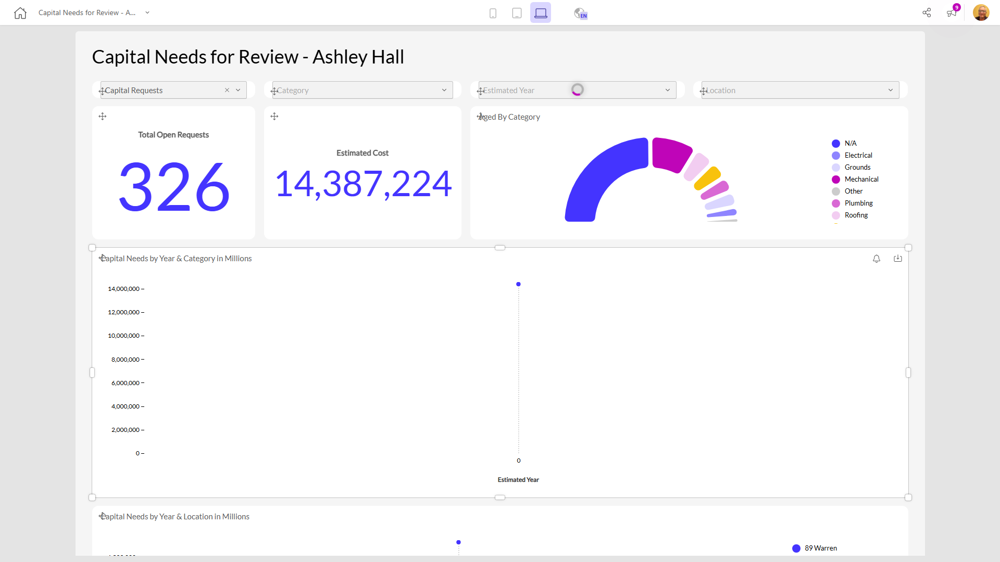

# Capital Needs for Review - Ashley Hall

**Collections:** Production Dashboards

## Screenshot

## AI-Generated Summary

This dashboard provides a comprehensive overview of capital needs for review at Ashley Hall. It includes a variety of data visualizations and interactive components that allow users to analyze open requests, estimated costs, and capital needs by year, category, and location. Key insights include the overall volume of open requests, total estimated costs, and the breakdown of needs by different attributes. This dashboard would be valuable for facilities managers, budget planners, and other stakeholders responsible for capital planning and resource allocation.

### Tags

`capital planning` `facilities management` `budget planning` `resource allocation` `cost analysis`

---

*Generated on 2026-01-29 12:48:47 by Luzmo API Tools*