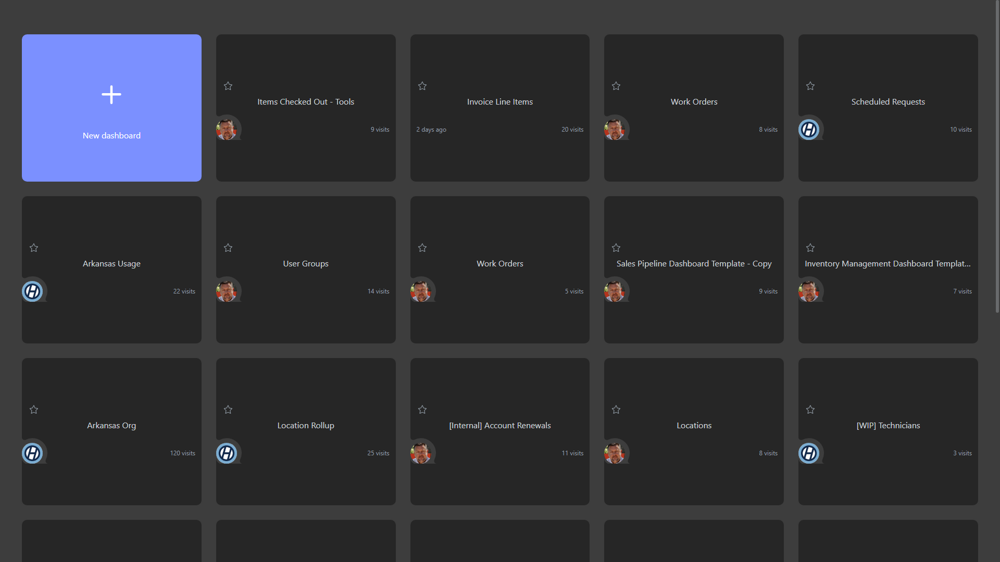

# STC - Inventory Reports

**Collections:** Client Dashboards

## Screenshot

## AI-Generated Summary

This dashboard provides comprehensive inventory reporting and analysis for an organization. It includes a range of components that allow users to view and interact with key inventory metrics, such as item counts, total value, and quantity to order. The dashboard includes interactive filters and selection tools to allow users to quickly analyze inventory data by item number, tag number, category, type, and storage location. Additionally, it provides summary reports and pivot tables to help users gain high-level insights into inventory trends and conditions. This dashboard would be valuable for inventory managers, supply chain professionals, and other business stakeholders who need to monitor and optimize inventory levels and operations.

### Tags

`inventory` `supply chain` `reporting` `analytics` `operations`

---

*Generated on 2026-01-29 12:48:58 by Luzmo API Tools*