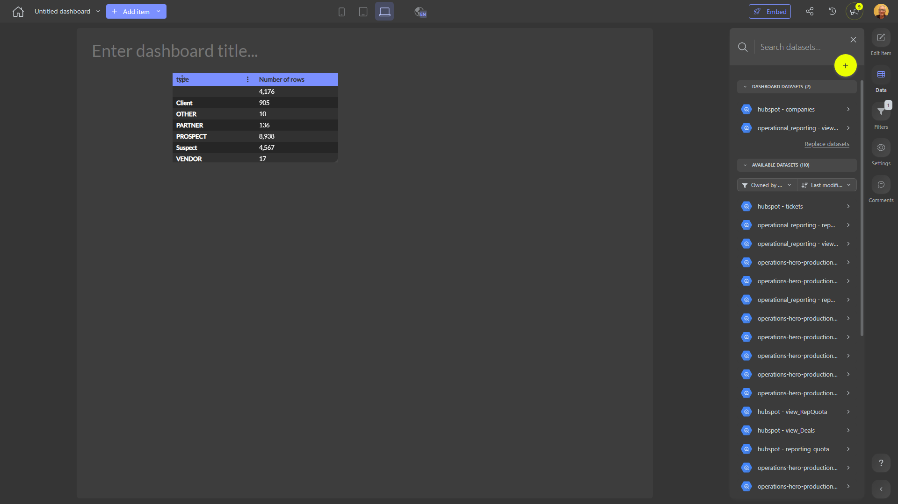

# 

**Collections:** None

## Screenshot

## Description

This dashboard appears to provide a high-level summary and analysis of key business data through the use of three pivot tables. 

The dashboard likely answers questions around the performance, trends, and breakdowns of the business's core metrics and KPIs. The pivot tables allow users to easily slice, dice, and drill down into the data from multiple angles to uncover insights.

Based on the lack of a specific existing description, this dashboard could be used by executives, managers, and analysts across the organization to monitor and understand the business's current state. It may cover topics like sales, financials, operations, or other important areas depending on the underlying data sources.

The inclusion of parameters suggests users may be able to filter or customize the data shown in the pivot tables, enabling them to get a tailored view for their specific needs or areas of focus.

Overall, this dashboard seems designed to give decision-makers a comprehensive, interactive view of critical business performance data in an easy-to-consume format. The pivot table components allow for flexible, self-service analysis to support data-driven decision making.

## AI-Generated Summary

This executive dashboard provides a high-level summary of key business metrics and KPIs through the use of three interactive pivot tables. It allows decision-makers to easily monitor, analyze, and gain insights into the company's performance, trends, and data breakdowns across important areas like sales, financials, operations, and more. The pivot table components enable flexible, self-service analysis, empowering users to slice, dice, and drill down into the data from multiple angles to uncover critical insights and support data-driven decision making.

### Tags

`business performance` `executive reporting` `data analytics` `interactive dashboards` `self-service insights`

---

*Generated on 2026-01-29 11:51:46 by Luzmo API Tools*