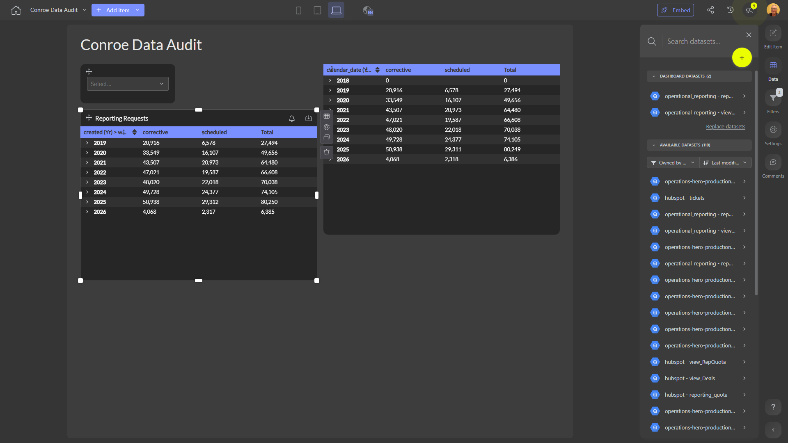

# Conroe Data Audit

**Collections:** None

## Screenshot

## Description

The Conroe Data Audit dashboard provides a comprehensive view of data reporting requests and related metrics for the Conroe region. This dashboard is likely used by data analysts, operations managers, and other business stakeholders who need to monitor and analyze the volume and status of data reporting requests.

The dashboard consists of 9 components, the majority of which are pivot tables that display detailed information about reporting requests. These pivot tables likely show metrics such as the number of requests, their status (e.g. pending, approved, rejected), the department or business unit associated with each request, and potentially other relevant dimensions.

To help users filter and explore the data, the dashboard also includes 3 dropdown filters. These filters likely allow users to segment the reporting request data by factors such as time period, request type, or organizational unit.

In total, the dashboard connects to 2 distinct data sources to bring together the necessary information for this data audit. It also includes 1 parameter, which may enable users to further customize the view or apply specific date ranges.

This dashboard empowers users to quickly understand the volume, status, and trends of data reporting requests in the Conroe region. It supports data-driven decision making around resource allocation, process improvements, and meeting reporting needs across the organization.

## AI-Generated Summary

The Conroe Data Audit dashboard provides a comprehensive overview of data reporting requests and related metrics for the Conroe region. This dashboard empowers data analysts, operations managers, and other business stakeholders to monitor the volume, status, and trends of reporting requests. The dashboard's pivot tables and filters enable users to quickly analyze factors such as request volume, approval status, and organizational associations. This data-driven insight supports decision-making around resource allocation, process improvements, and meeting reporting needs across the organization.

### Tags

`data audit` `reporting requests` `business operations` `data analytics` `resource management`

---

*Generated on 2026-01-29 12:45:08 by Luzmo API Tools*