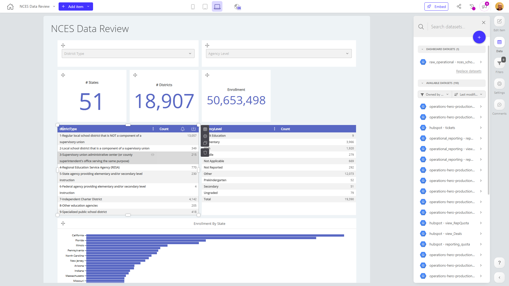

# NCES Data Review

**Collections:** Internal

## Screenshot

## Description

The NCES Data Review dashboard provides a comprehensive overview of key education data and metrics from the National Center for Education Statistics (NCES). This dashboard is likely used by education administrators, policy makers, and researchers to analyze trends and patterns in the K-12 education system across the United States.

The dashboard contains a total of 27 components, including:
- 9 evolution number components that display counts of states and districts over time
- 9 pivot tables that allow for deeper exploration and analysis of education data
- 6 dropdown filters that enable users to segment and analyze the data by different criteria
- 3 bar charts that visualize enrollment trends by state

Some of the key metrics and insights this dashboard provides include:
- The total number of states and districts in the NCES data
- Enrollment figures broken down by state
- Trends and changes in the number of states and districts over time

With its range of data visualization and exploration tools, this dashboard empowers users to understand the current state of K-12 education in the US, identify areas for improvement, and make more informed decisions about education policy and resource allocation. The dashboard's flexible filtering and pivot table capabilities also allow users to dive deeper into the data and uncover more granular insights.

Overall, the NCES Data Review dashboard is a valuable resource for anyone involved in education planning, administration, or research at the state or national level.

## AI-Generated Summary

The NCES Data Review dashboard provides a comprehensive overview of key education data and metrics from the National Center for Education Statistics (NCES). This dashboard empowers education administrators, policymakers, and researchers to analyze trends and patterns in the K-12 education system across the United States. The dashboard offers a range of data visualization and exploration tools, including enrollment figures broken down by state, the total number of states and districts, and how these metrics have changed over time. Users can leverage the flexible filtering and pivot table capabilities to dive deeper into the data and uncover granular insights, enabling them to make more informed decisions about education policy and resource allocation.

### Tags

`education` `data analysis` `k-12` `policy` `trends`

---

*Generated on 2026-01-29 12:44:05 by Luzmo API Tools*