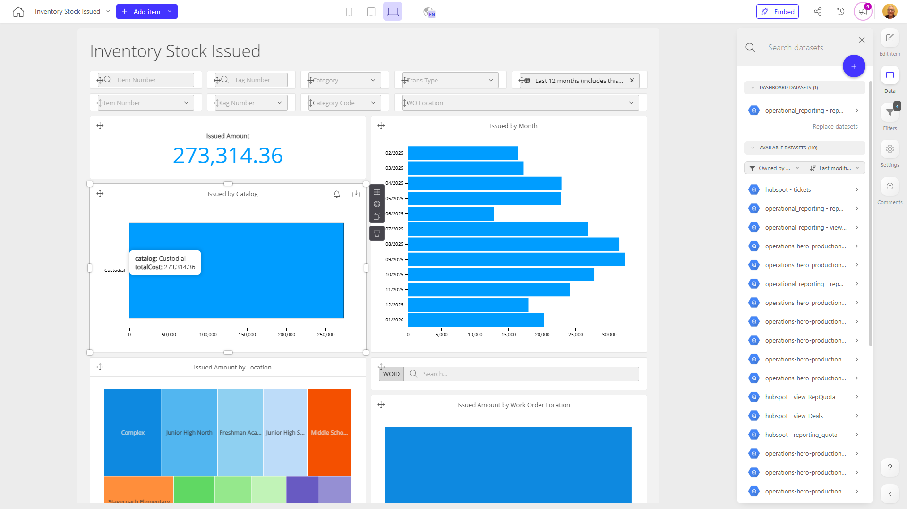

# Apache Superset Dashboard Implementation Recommendation

**Date:** 2026-01-30
**Purpose:** Testing Apache Superset features with Luzmo dashboard data

---

## Recommended Dashboard: Inventory Stock Issued

**Dashboard ID:** `de282d0e-4da3-4a18-80c2-3a8dbf3fea1d`
**Short ID:** `de282d0e`
**Collection:** Production Dashboards
**Tags:** `inventory management`, `supply chain`, `data visualization`, `operations`, `procurement`

### Screenshot


---

## Why This Dashboard is Ideal for Superset Testing

### 1. Diverse Visualization Types

This dashboard showcases multiple chart types that map directly to Superset capabilities:

| Luzmo Visualization | Superset Equivalent | Purpose |
|---------------------|---------------------|---------|
| Bar Charts | Bar Chart / Column Chart | Volume of items issued by month, catalog, location |
| Treemap Charts | Treemap | Visual breakdown by location and work order location |
| Pivot Tables | Pivot Table | Detailed analysis by location/time |
| Evolution Numbers | Big Number with Trendline | KPI metrics (current value in stock) |
| Data Tables | Table | Detailed line-item data |

### 2. Rich Filter Capabilities

Tests Superset's interactive filtering features:

- **Dropdown Filters:**
  - Tag Number
  - Type
  - Item Number
  - Category Code

- **Date Range Filter:** Time-based analysis of inventory issues

- **Search Functionality:** Quick item/transaction lookup

### 3. Clear Business Value

**Primary Users:**
- Inventory managers
- Warehouse staff
- Procurement teams

**Use Cases:**
- Track inventory distribution and movement
- Identify trends in inventory issues
- Optimize inventory levels
- Ensure efficient resource allocation

### 4. Moderate Complexity

**Advantages:**
- ✓ Not too simple - tests various Superset features
- ✓ Not overwhelming - manageable for initial implementation
- ✓ Well-balanced for learning curve
- ✓ Real operational data with business context

---

## Dashboard Description

The Inventory Stock Issued dashboard provides a comprehensive view of inventory items that have been distributed from a company's stock. It enables users to:

- Filter and narrow down data by specific inventory attributes
- Analyze inventory issues over time using date filters
- Quickly find specific items or transactions via search
- Visualize issued amounts through multiple chart types:
  - Bar charts showing volume by month, catalog, and location
  - Treemap charts for visual breakdown by location and work order
  - Pivot tables for detailed time-series analysis
- Track current value in stock with evolution metrics

This dashboard helps stakeholders gain insights into inventory movement and distribution, enabling data-driven decisions to optimize inventory levels and ensure efficient allocation of resources.

---

## Superset Implementation Roadmap

### Phase 1: Data Connection
1. Identify data source for inventory stock issued data
2. Connect Superset to the database/API
3. Create dataset in Superset with required columns

### Phase 2: Basic Visualizations
1. **Create Bar Charts:**
   - Issued amounts by month
   - Issued amounts by catalog
   - Issued amounts by location

2. **Create Treemap Charts:**
   - Breakdown by location
   - Breakdown by work order location

3. **Create Pivot Table:**
   - Location × Time analysis
   - Work order location × Time analysis

### Phase 3: Filters and Interactivity
1. Add dropdown filters for:
   - Tag Number
   - Type
   - Item Number
   - Category Code

2. Implement date range filter

3. Add search/filter capabilities

### Phase 4: Dashboard Assembly
1. Arrange visualizations in logical layout
2. Configure cross-filtering between charts
3. Add KPI metrics (Big Number charts)
4. Test interactivity and performance

---

## Alternative Dashboard Recommendations

### Option 2: Invoice Line Items (Simpler)
**Dashboard ID:** `d0938016-9616-4d99-8cb6-46b3dd110ded`
**Best For:** Testing tables, filters, and time series

**Visualizations:**
- Data tables (detailed invoice line items)
- Evolution numbers (time-based metrics)
- Date and dropdown filters
- Search functionality

**Pros:**
- Simpler structure
- Good for learning Superset basics
- Financial data with clear metrics

**Cons:**
- Less visualization variety
- Primarily table-focused

### Option 3: Work Order Progress (More Complex)
**Dashboard ID:** `2a354dc7` (full UUID: `2a354dc7-xxxx-xxxx-xxxx-xxxxxxxxxxxx`)
**Best For:** Testing progress tracking and status visualizations

**Visualizations:**
- Status-based charts
- Progress indicators
- Timeline visualizations
- Multi-status filters

**Pros:**
- More complex workflow visualization
- Tests progress/status features
- Real-time operational metrics

**Cons:**
- Higher complexity for initial testing
- May require more data understanding

---

## Next Steps

### 1. Export Dashboard Metadata
```bash
# Export all dashboard details to Excel
python export_dashboards.py

# Export dataset information
python export_datasets.py
```

### 2. View Dashboard Documentation
- **Markdown Documentation:** [dashboard_docs/dashboard_de282d0e.md](dashboard_docs/dashboard_de282d0e.md)
- **Dashboard Index:** [dashboard_docs/README.md](dashboard_docs/README.md)

### 3. Access Dashboard in Luzmo
**URL:** `https://app.us.luzmo.com/dashboard/de282d0e-4da3-4a18-80c2-3a8dbf3fea1d`

### 4. Get Dataset Details
```bash
# Search for datasets used by this dashboard
python dashboard_summary.py --search "inventory stock"

# Export dataset relationships
python export_datasets.py
# Then check the Dataset_Usage sheet for dashboard de282d0e
```

### 5. Implementation Support
If you need help with:
- Extracting data schema for Superset
- Understanding data relationships
- Mapping Luzmo features to Superset
- Troubleshooting implementation issues

Just ask!

---

## Technical Reference

### Dashboard Files
- **Documentation:** `dashboard_docs/dashboard_de282d0e.md`
- **Screenshot:** `screenshots/Inventory_Stock_Issued_de282d0e.png`
- **Full UUID:** `de282d0e-4da3-4a18-80c2-3a8dbf3fea1d`

### Related Commands
```bash
# View dashboard in CLI
python dashboard_summary.py --search "inventory stock"

# Get full dashboard details
python -c "from src.dashboard_exporter import DashboardExporter; e = DashboardExporter(); print(e.get_dashboard_contents('de282d0e-4da3-4a18-80c2-3a8dbf3fea1d'))"
```

---

## Summary

**Recommendation:** Start with **Inventory Stock Issued** (`de282d0e`)

**Why:**
- ✓ Perfect balance of complexity and manageability
- ✓ Diverse visualization types showcase Superset capabilities
- ✓ Rich filtering demonstrates interactivity
- ✓ Clear business value and use case
- ✓ Real operational data with context

**Expected Outcomes:**
- Test Superset's chart variety (bar, treemap, pivot, KPI)
- Validate filter and search capabilities
- Evaluate dashboard composition and layout
- Assess performance with real data
- Understand migration effort from Luzmo to Superset

Good luck with your Superset implementation! 🚀
